```{css, echo=FALSE} 
@media print { # print out incremental slides; see https://stackoverflow.com/questions/56373198/get-xaringan-incremental-animations-to-print-to-pdf/56374619#56374619
  .has-continuation {
    display: block !important;
  }
}
```

```{r setup, include=FALSE}
# figures formatting setup
options(htmltools.dir.version = FALSE)
library(knitr)
opts_chunk$set(
  comment = "  ",
  prompt = T,
  fig.align="center", #fig.width=6, fig.height=4.5, 
  # out.width="748px", #out.length="520.75px",
  dpi=300, #fig.path='Figs/',
  cache=F, #echo=F, warning=F, message=F
  engine.opts = list(bash = "-l")
  )

## Next hook based on this SO answer: https://stackoverflow.com/a/39025054
knit_hooks$set(
  prompt = function(before, options, envir) {
    options(
      prompt = if (options$engine %in% c('sh','bash')) '$ ' else 'R> ',
      continue = if (options$engine %in% c('sh','bash')) '$ ' else '+ '
      )
})

library(tidyverse)
library(nycflights13)
library(kableExtra)
```


# Table of contents

<br>


1. [Recap: R and the tidyverse](#tidyverse)

2. [Functions](#functions)

3. [Project management](#projects)

4. [Coding style](#style)

5. [Debugging](#debugging)


<!-- ############################################ -->
---
class: inverse, center, middle
name: tidyverse

# Recap: tidyverse basics

<html><div style='float:left'></div><hr color='#EB811B' size=1px style="width:1000px; margin:auto;"/></html>

---

# What is the tidyverse?

.pull-left[
### R packages for data science

- Let's take it from the [tidyverse website](https://www.tidyverse.org/):

**"The tidyverse is an opinionated collection of R packages designed for data science. All packages share an underlying design philosophy, grammar, and data structures."**

- It's the contribution of many people of the R community.
- [Hadley Wickham](http://hadley.nz/) had a key role in shaping it by developing many of the core packages, such as `ggplot2`, `dplyr`, `tidyr`, `tibble`, and `stringr`.
- Install the complete tidyverse with:

```{r, eval = FALSE}
install.packages("tidyverse")
```
]

.pull-right-center[
<div align="center">
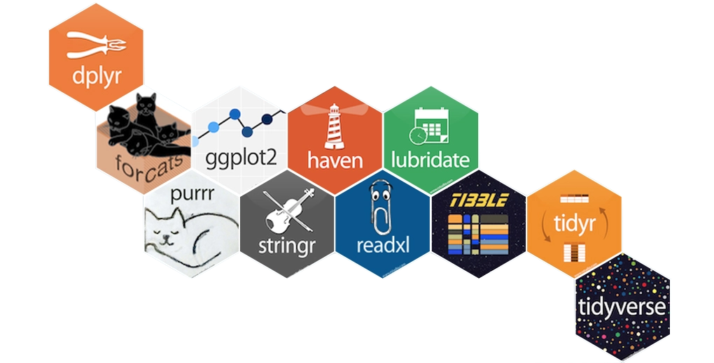
</div>
<div align="center">

</div>
Hadley Wickham
]

---

# A guide to the tidyverse

.pull-left[
### Valuable resources

- [Welcome to the Tidyverse](https://tidyverse.tidyverse.org/articles/paper.html), a quick overview from many tidyverse contributors
- [Tidy data](https://vita.had.co.nz/papers/tidy-data.pdf), a foundational paper on data wrangling and structuring, by Hadley Wickham, 2014, *Journal of Statistical Software*; check [here](https://cran.r-project.org/web/packages/tidyr/vignettes/tidy-data.html) for a hands-on vignette based on the `tidyr` package
- [The tidyverse design guide](https://design.tidyverse.org/), a (soon-to-be book) manifesto to promote design consistency across the tidyverse
- [R for Data Science](https://r4ds.hadley.nz/), our main textbook for this course
]

.pull-right-center[
<div align="center">
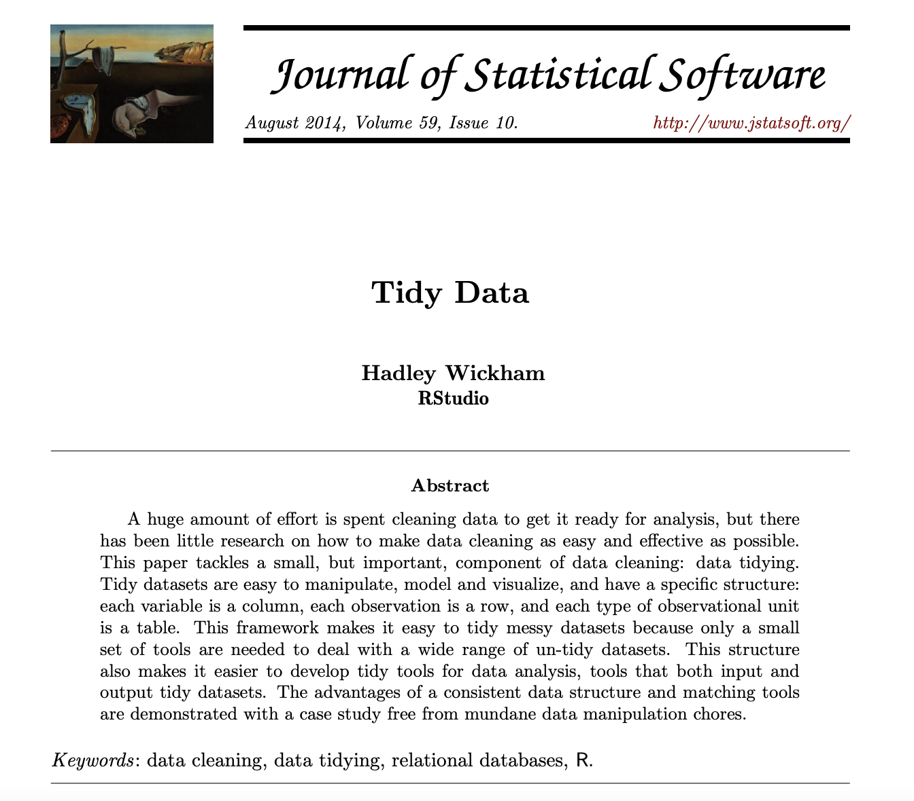
</div>
<div align="center">

</div>
]


---

# Tidyverse packages

### Loading the tidyverse

```{r tverse, cache = FALSE}
library(tidyverse)
```

- In addition to the currently 8 core packages, the tidyverse includes many others for more specialized usage.<sup>1</sup>
- We'll use several of these additional packages during the remainder of this course (e.g., the `rvest` package for web scraping). Bear in mind that these packages will have to be loaded separately.
- See [here](https://www.tidyverse.org/packages/) for an overview, or just in R directly:

```{r wide-output, include=FALSE}
options(width = 120)
```

```{r tverse_pkgs}
tidyverse_packages()
```

.footnote[
<sup>1</sup> It also includes a *lot* of dependencies upon installation. This is a matter of some [controversy](http://www.tinyverse.org/).
]


---
# Tidyverse vs. base R

<div align="center">
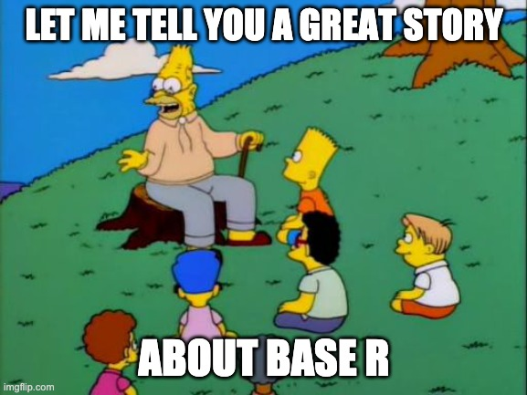
</div>


---

# Tidyverse vs. base R: what's the difference?

- Both are compatible. You can wrangle your data with `dplyr`, plot it with `ggplot2`, and model it with yet another package.
- Ultimately, the tidyverse is just a bunch of (hugely popular!) packages that share design principles.
- Often, tidyverse packages don't reinvent the wheel. Instead, they offer more consistency in naming, arguments, and output (among other things).
- For instance, compare function naming principles (`tidyverse::snake_case` vs `base::period.case` rule; more on these conventions later) in these examples:

| tidyverse  |  base |
|---|---|
| `?readr::read_csv`  | `?utils::read.csv` |
|  `?dplyr::if_else` |  `?base::ifelse` |
|  `?tibble::tibble` |  `?base::data.frame` |

- If you call up the above examples, you'll see that the tidyverse alternative typically offers some enhancements or other useful options (and sometimes restrictions) over its base counterpart.

--

- And **remember:** There are (almost) always multiple ways to achieve a single goal in R.


---

# Tidyverse vs. base R: what's the difference? *cont.*

.pull-left-center[
**Tidyverse**

<div align="center">

</div>

`Credit` [sawiki.com](https://www.sakwiki.com/tiki-index.php?page=Craftsman)
]

--

.pull-right-center[
**Base R**
<div align="center">

</div>

`Credit` [multimedialab.be](http://www.multimedialab.be/doc/images/index.php?album=design&image=2007_Wenger_Giant_Swiss_Knife_2007.jpg)

]


---

# Tidyverse vs. base R: what to use?

.pull-left[
### Stories from the past

- When I started to learn R ~19 years ago, there was no tidyverse. The learning curve felt much steeper. I often switched back to Stata for data wrangling.
- As the tidyverse grew, R became more convenient to use for the entire research pipeline.
- There's simply no need for you to live through the same pain.

### Why we start with the tidyverse

- Because [clever people think it's the right way](http://varianceexplained.org/r/teach-tidyverse/).
- Documentation + community support are great.
- Having a consistent syntax makes it easier to learn.
]

--

.pull-right[

### You still will want to check out base R alternatives later

- Base R is extremely flexible and powerful (and stable).
- There are some things that you'll have to venture outside of the tidyverse for.
- A combination of tidyverse and base R is often the best solution to a problem.
- Excellent base R data manipulation tutorial [here](https://github.com/matloff/fasteR).

]


<!-- ############################################ -->
---
class: inverse, center, middle
name: functions

# Functions

<html><div style='float:left'></div><hr color='#EB811B' size=1px style="width:1000px; margin:auto;"/></html>


---

# Tidy programming basics

"Tidy programming" is not a strictly defined practice in the tidyverse. However, there are some common programming strategies that help you keep your code and workflow tidy. These include:

- Pipes (you already learned how to use them ✅)
- User-generated functions
- Functional programming with `purrr`

--

The latter two are extremely helpful - in particular when you are confronted with iterative tasks.

--

We will now learn the basics of creating your own functions and functional programming with R. There is much more to learn about these topics, so we will revisit them as the course progresses.


---
# Functional programming

R is a functional programming (FP) language. As Hadley Wickham puts it in [Advanced R](https://adv-r.hadley.nz/fp.html):

> This means that it provides many tools for the creation and manipulation of functions. In particular, R has what’s known as first-class functions. You can do anything with functions that you can do with vectors: you can assign them to variables, store them in lists, pass them as arguments to other functions, create them inside functions, and even return them as the result of a function.

R encourages you to use and build your own functions to solve problems. Often, this implies decomposing a large problem into small pieces, and solving each of them with independent functions.

There is much more to learn about functions and [functional programming](https://en.wikipedia.org/wiki/Functional_programming). Useful resources include:

- The chapter on functions in [R for Data Science](https://r4ds.hadley.nz/functions.html).
- The section on functional programming in [Advanced R](https://adv-r.hadley.nz/fp.html).
- The [R packages](https://r-pkgs.org/) book. In a way, bundling functions in a package is sometimes the next logical step.


---
# Creating functions

### Why creating functions?

That's a legit question. There are 22,000+ **packages** on [CRAN](https://cran.r-project.org/) (and many, many more on GitHub and other repositories) containing zillions of functions. Why should you create yet another one?
- Every data science project is unique. There are problems only you have to solve. 
- For problems that are repetitive, you'll quickly look for options to automate the task.
- Functions are a great way to automate.

--

### Examples where creating functions makes sense

--

1. You want to scrape thousands of websites. This implies multiple steps, from downloading to parsing and cleaning. All these steps can be achieved with existing functions, but the fine-tuning is specific to the set of websites. You build one (or a set of) scraping functions that take the websites as input and return a cleaned data frame ready to be analyzed.

--

2. You want to estimate not one but multiple models on your dataset. The models vary both in terms of data input and specification. Again, based on existing modeling functions you tailor your own, allowing you to run all these models automatically and to parse the results into one clean data frame.

---

# What kinds of functions will you write?

Most functions you will write as a data scientist fall into one of three types:

|   | Vector functions | Data frame functions | Plot functions |
|---|------------------|----------------------|----------------|
| **Input** | One or more vectors | A data frame (+ column names) | A data frame (+ column names) |
| **Output** | A vector | A data frame | A plot |
| **Typical use** | Inside `mutate()`, `filter()`, or `summarize()` | As a custom verb wrapping a repeated dplyr pipeline | As a recipe wrapping repeated ggplot2 code |
| **Example** | `z_score(x)` | `grouped_mean(df, ...)` | `histogram(df, var)` |

--

Some foreshadowing - there's more out there, but no reason to panic yet:

- **Functions made for iteration**, which you pass on to other functions such as `purrr::map()`. See next session!
- **Functions with side effects**, which you call for what they do (saving a file, printing a message), not for what they return.
- **Bundles of functions**, aka packages. Once your functions prove useful beyond a single project, [bundling them in a package](https://r-pkgs.org/) is the next logical step.


---

# Basic syntax

.pull-left[
Writing your own function in R is easy with the `function()` function<sup>1</sup>. The basic syntax is as follows:

```{r, eval = FALSE}
my_func <- function(ARGUMENTS) {
    OPERATIONS
    return(VALUE)
  }
```

.footnote[<sup>1</sup> Yes, a function to create functions. 🤯]
]

---

# Basic syntax

.pull-left[
Writing your own function in R is easy with the `function()` function<sup>1</sup>. The basic syntax is as follows:

```{r, eval = FALSE}
my_func <- function(ARGUMENTS) { #<<
    OPERATIONS
    return(VALUE)
  }
```

- We write functions to apply them later. So, we have to give them a name. Here, we name it "`my_func`".
- Also, our function (almost) always needs input, plus we want to specify how exactly the function should behave. We can use arguments for this, which are specified as arguments of the `function()` function.

.footnote[<sup>1</sup> Yes, a function to create functions. 🤯]
]

---

# Basic syntax

.pull-left[
Writing your own function in R is easy with the `function()` function<sup>1</sup>. The basic syntax is as follows:

```{r, eval = FALSE}
my_func <- function(ARGUMENTS) {
    OPERATIONS #<<
    return(VALUE)
  }
```

- Next, we specify anything we want the function to do.
- This comes in between curly brackets, `{...}`.
- Importantly, we can recycle arguments by calling them by their name.

.footnote[<sup>1</sup> Yes, a function to create functions. 🤯]
]

---

# Basic syntax

.pull-left[
Writing your own function in R is easy with the `function()` function<sup>1</sup>. The basic syntax is as follows:

```{r, eval = FALSE}
my_func <- function(ARGUMENTS) {
    OPERATIONS 
    return(VALUE) #<<
  }
```

- Finally, we specify what the function should return. 
- This could be a list, data.frame, vector, sentence - or anything else really.
- Note that R automatically returns the final object that is written (not: assigned!) in your function by default. Still, my recommendation is that you get into the habit of assigning the return object(s) explicitly with `return()`.

.footnote[<sup>1</sup> Yes, a function to create functions. 🤯]
]

---

# Basic syntax

.pull-left[
Writing your own function in R is easy with the `function()` function<sup>1</sup>. The basic syntax is as follows:

```{r, eval = FALSE}
my_func <- function(ARGUMENTS) {
    OPERATIONS 
    return(VALUE) 
  } #<<
```

- Oh, and don't forget to close the curly brackets...

.footnote[<sup>1</sup> Yes, a function to create functions. 🤯]
]

---

# Basic syntax

.pull-left[
Writing your own function in R is easy with the `function()` function<sup>1</sup>. The basic syntax is as follows:

```{r, eval = FALSE}
my_func <- function(ARGUMENTS) {
    OPERATIONS 
    return(VALUE) 
  } 
```

.footnote[<sup>1</sup> Yes, a function to create functions. 🤯]
]

.pull-right[
Let's try it out with a simple example function - one that converts temperatures from [Fahrenheit to Celsius](https://en.wikipedia.org/wiki/Conversion_of_scales_of_temperature#Fahrenheit):<sup>2</sup>

```{r, eval = FALSE}
fahrenheit_to_celsius <- function(temp_F) {
  temp_C <- (temp_F - 32) * (5/9)
  return(temp_C)
}
```

.footnote[<sup>2</sup> Courtesy of [Software Carpentry](https://swcarpentry.github.io/r-novice-inflammation/02-func-R.html).]

]

---

# Basic syntax

.pull-left[
Writing your own function in R is easy with the `function()` function<sup>1</sup>. The basic syntax is as follows:

```{r, eval = FALSE}
my_func <- function(ARGUMENTS) {
    OPERATIONS 
    return(VALUE) 
  } 
```

.footnote[<sup>1</sup> Yes, a function to create functions. 🤯]
]

.pull-right[
Let's try it out with a simple example function - one that converts temperatures from [Fahrenheit to Celsius](https://en.wikipedia.org/wiki/Conversion_of_scales_of_temperature#Fahrenheit):<sup>2</sup>

```{r, eval = FALSE}
fahrenheit_to_celsius <- function(temp_F) { #<<
  temp_C <- (temp_F - 32) * (5/9)
  return(temp_C)
}
```

- Our function has an intuitive name.
- Also, it takes just one thing as input, which we call `temp_F`.

.footnote[<sup>2</sup> Courtesy of [Software Carpentry](https://swcarpentry.github.io/r-novice-inflammation/02-func-R/).]

]

---

# Basic syntax

.pull-left[
Writing your own function in R is easy with the `function()` function<sup>1</sup>. The basic syntax is as follows:

```{r, eval = FALSE}
my_func <- function(ARGUMENTS) {
    OPERATIONS 
    return(VALUE) 
  } 
```

.footnote[<sup>1</sup> Yes, a function to create functions. 🤯]
]

.pull-right[
Let's try it out with a simple example function - one that converts temperatures from [Fahrenheit to Celsius](https://en.wikipedia.org/wiki/Conversion_of_scales_of_temperature#Fahrenheit):<sup>2</sup>

```{r, eval = FALSE}
fahrenheit_to_celsius <- function(temp_F) {
  temp_C <- (temp_F - 32) * (5/9)  #<<
  return(temp_C)
}
```

- We now take up the argument `temp_F`, do something with it, and store the output in a new object, `temp_C`.
- Importantly, that object only lives within the function. When the function is run, we cannot access it from the environment.


.footnote[<sup>2</sup> Courtesy of [Software Carpentry](https://swcarpentry.github.io/r-novice-inflammation/02-func-R/).]

]

---

# Basic syntax

.pull-left[
Writing your own function in R is easy with the `function()` function<sup>1</sup>. The basic syntax is as follows:

```{r, eval = FALSE}
my_func <- function(ARGUMENTS) {
    OPERATIONS 
    return(VALUE) 
  } 
```

.footnote[<sup>1</sup> Yes, a function to create functions. 🤯]
]

.pull-right[
Let's try it out with a simple example function - one that converts temperatures from [Fahrenheit to Celsius](https://en.wikipedia.org/wiki/Conversion_of_scales_of_temperature#Fahrenheit):<sup>2</sup>

```{r, eval = FALSE}
fahrenheit_to_celsius <- function(temp_F) {
  temp_C <- (temp_F - 32) * (5/9)
  return(temp_C)   #<<
}
```

- Finally, the output is returned.


.footnote[<sup>2</sup> Courtesy of [Software Carpentry](https://swcarpentry.github.io/r-novice-inflammation/02-func-R/).]

]

---

# Basic syntax

.pull-left[
Writing your own function in R is easy with the `function()` function<sup>1</sup>. The basic syntax is as follows:

```{r, eval = FALSE}
my_func <- function(ARGUMENTS) {
    OPERATIONS 
    return(VALUE) 
  } 
```

.footnote[<sup>1</sup> Yes, a function to create functions. 🤯]
]

.pull-right[
Let's try it out with a simple example function - one that converts temperatures from [Fahrenheit to Celsius](https://en.wikipedia.org/wiki/Conversion_of_scales_of_temperature#Fahrenheit):

```{r, eval = TRUE}
fahrenheit_to_celsius <- function(temp_F) {
  temp_C <- (temp_F - 32) * (5/9)
  return(temp_C)
}
```

Now, let's try out the function:
{{content}}
]

--

```{r, eval = TRUE}
fahrenheit_to_celsius(451)
```
{{content}}

--

Pretty hot, isn't it?
{{content}}

---

# Functions: default argument values, if(), else()

.pull-left[

Let's make the function a bit more complex, but also more fun.
]

.pull-right[

```{r, eval = FALSE}
temp_convert <- 
  function(temp, from = "f") {
  if (!(from %in% c("f", "c"))){ 
    stop("No valid input 
          temperature specified.")
  }
  if (from == "f") {
    out <- (temp - 32) * (5/9)
  } else {
    out <- temp * (9/5) + 32
  }
  if((from == "c" & temp > 30) | 
     (from == "f" & out > 30)) {
    message("That's damn hot!")
  }else{
    message("That's not so hot.")
  }
  return(out) # return temperature
}
```
]

---

# Functions: default argument values, if(), else()

.pull-left[

Let's make the function a bit more complex, but also more fun.

- By giving `from` a default value (`"f"`), we ensure that the function returns valid output when only the key input, `temp`, is provided.
]

.pull-right[

```{r, eval = FALSE}
temp_convert <- 
  function(temp, from = "f") { #<<
  if (!(from %in% c("f", "c"))){ 
    stop("No valid input 
          temperature specified.")
  }
  if (from == "f") {
    out <- (temp - 32) * (5/9)
  } else {
    out <- temp * (9/5) + 32
  }
  if((from == "c" & temp > 30) | 
     (from == "f" & out > 30)) {
    message("That's damn hot!")
  }else{
    message("That's not so hot.")
  }
  return(out) # return temperature
}
```
]


---

# Functions: default argument values, if(), else()

.pull-left[

Let's make the function a bit more complex, but also more fun.

- By giving `from` a default value (`"f"`), we ensure that the function returns valid output when only the key input, `temp`, is provided.
- `if() {...}` allows us to make conditional statements. Here, we test for the validity of the input for argument `from`.

]

.pull-right[

```{r, eval = FALSE}
temp_convert <- 
  function(temp, from = "f") { 
  if (!(from %in% c("f", "c"))){ #<<
    stop("No valid input 
          temperature specified.")
  }
  if (from == "f") {
    out <- (temp - 32) * (5/9)
  } else {
    out <- temp * (9/5) + 32
  }
  if((from == "c" & temp > 30) | 
     (from == "f" & out > 30)) {
    message("That's damn hot!")
  }else{
    message("That's not so hot.")
  }
  return(out) # return temperature
}
```
]


---

# Functions: default argument values, if(), else()

.pull-left[

Let's make the function a bit more complex, but also more fun.

- By giving `from` a default value (`"f"`), we ensure that the function returns valid output when only the key input, `temp`, is provided.
- `if() {...}` allows us to make conditional statements. Here, we test for the validity of the input for argument `from`.
- If the condition is not met, the function breaks and prints a message.

]

.pull-right[

```{r, eval = FALSE}
temp_convert <- 
  function(temp, from = "f") { 
  if (!(from %in% c("f", "c"))){ 
    stop("No valid input 
          temperature specified.") #<<
  }
  if (from == "f") {
    out <- (temp - 32) * (5/9)
  } else {
    out <- temp * (9/5) + 32
  }
  if((from == "c" & temp > 30) | 
     (from == "f" & out > 30)) {
    message("That's damn hot!")
  }else{
    message("That's not so hot.")
  }
  return(out) # return temperature
}
```
]

---

# Functions: default argument values, if(), else()

.pull-left[

Let's make the function a bit more complex, but also more fun.

- By giving `from` a default value (`"f"`), we ensure that the function returns valid output when only the key input, `temp`, is provided.
- `if() {...}` allows us to make conditional statements. Here, we test for the validity of the input for argument `from`.
- If the condition is not met, the function breaks and prints a message.
- With `else()`, we specify what to do if the `if()` condition is not met.
]

.pull-right[

```{r, eval = FALSE}
temp_convert <- 
  function(temp, from = "f") { 
  if (!(from %in% c("f", "c"))){ 
    stop("No valid input 
          temperature specified.")
  }
  if (from == "f") {
    out <- (temp - 32) * (5/9)
  } else {  #<<
    out <- temp * (9/5) + 32
  }
  if((from == "c" & temp > 30) | 
     (from == "f" & out > 30)) {
    message("That's damn hot!")
  }else{
    message("That's not so hot.")
  }
  return(out) # return temperature
}
```
]

---

# Functions: default argument values, if(), else()

.pull-left[

Let's make the function a bit more complex, but also more fun.

- By giving `from` a default value (`"f"`), we ensure that the function returns valid output when only the key input, `temp`, is provided.
- `if() {...}` allows us to make conditional statements. Here, we test for the validity of the input for argument `from`.
- If the condition is not met, the function breaks and prints a message.
- With `else()`, we specify what to do if the `if()` condition is not met.
- Make R more talkative with `message()`. Future-You will like it!
]

.pull-right[

```{r, eval = FALSE}
temp_convert <- 
  function(temp, from = "f") { 
  if (!(from %in% c("f", "c"))){ 
    stop("No valid input 
          temperature specified.")
  }
  if (from == "f") {
    out <- (temp - 32) * (5/9)
  } else {  
    out <- temp * (9/5) + 32
  }
  if((from == "c" & temp > 30) | 
     (from == "f" & out > 30)) {
    message("That's damn hot!") #<<
  }else{
    message("That's not so hot.") #<<
  }
  return(out) # return temperature
}
```
]


---

# Anonymous functions

In R, functions are objects in their own right. They aren’t automatically bound to a name. If you choose not to give the function a name, you get an **anonymous function**. You use an anonymous function when it’s not worth the effort to give it a name.

--

**Examples:**

```{r, eval = FALSE}
map(char_vec, function(x) paste(x, collapse = "|")) 
integrate(function(x) sin(x) ^ 2, 0, pi)
```


---

# Anonymous functions

In R, functions are objects in their own right. They aren’t automatically bound to a name. If you choose not to give the function a name, you get an **anonymous function**. You use an anonymous function when it’s not worth the effort to give it a name.

As of `R 4.1.0`, there's a new shorthand syntax for anonymous functions: `\(x)`.

--

**Example:**

```{r, eval = TRUE}
(function (x) {paste(x, 'is awesome!')})('Data science') # old syntax
(\(x) {paste(x, 'is awesome!')})('Data science') # new syntax
```


---

# Anonymous functions

In R, functions are objects in their own right. They aren’t automatically bound to a name. If you choose not to give the function a name, you get an **anonymous function**. You use an anonymous function when it’s not worth the effort to give it a name.

As of `R 4.1.0`, there's a new shorthand syntax for anonymous functions: `\(x)`. This plays along nicely with the (native) pipe when we want to pass content to the RHS but not to the first argument.


---

# Anonymous functions

In R, functions are objects in their own right. They aren’t automatically bound to a name. If you choose not to give the function a name, you get an **anonymous function**. You use an anonymous function when it’s not worth the effort to give it a name.

As of `R 4.1.0`, there's a new shorthand syntax for anonymous functions: `\(x)`. This plays along nicely with the (native) pipe when we want to pass content to the RHS but not to the first argument.

**Example:**

```{r, eval = FALSE}
mtcars |> subset(cyl == 4) |> (\(x) lm(mpg ~ disp, data = x))()
```


---
# `...` (Dot-dot-dot)

Functions can have a special argument `...` (pronounced *dot-dot-dot*). In other programming languages, this type of argument is often called varargs (short for variable arguments), or ellipsis. With it, a function can take any number of additional arguments. That is potentially very powerful!

A common application is to use `...` to pass those additional arguments on to another function.

--

.pull-left[
**Toy example:**

```{r, eval = TRUE}
my_list_generator <- function(y, z) {
  list(y = y, z = z)
}
my_list_generator_2 <- function(x, ...) {
  my_list_generator(...)
}

str(my_list_generator_2(x = 1, y = 2, z = 3))
```
]

--

.pull-right[
**Real-life example:**

```{r, eval = FALSE}
map(.x, .f, ...)
map(mtcars, mean, na.rm = TRUE)
```

Arguments:

- `.x`: A list or atomic vector
- `.f`: A function
- `...`: Additional arguments passed on to the mapped function.

]


---
# Data frame functions

.pull-left[
## The problem 

Once you catch yourself repeating the same dplyr pipeline over and over, the obvious next step is to wrap it in a function - a **data frame function** that works like a custom dplyr verb.

Say we often compute group-wise means. Easy to functionalize, right?

- We pass the data frame plus the names of a grouping variable and a target variable.
- The function pipes them through `group_by()` and `summarize()`.
- What could possibly go wrong?
]

.pull-right[
```{r, eval = FALSE}
grouped_mean <-
  function(df, group_var, mean_var) {
  df |>
    group_by(group_var) |>
    summarize(
      mean = mean(mean_var,
                  na.rm = TRUE))
}
```
{{content}}
]

--

```{r, eval = FALSE}
grouped_mean(flights, origin, arr_delay)
```

```r
#> Error in `group_by()`:
#> ! Must group by variables found in `.data`.
#> ✖ Column `group_var` is not found.
```
{{content}}

--

😱 dplyr complains that there is no column called `group_var` - even though we clearly meant "the variable *stored in* `group_var`", i.e. `origin`. Welcome to the problem of **indirection**.


---
# Indirection and tidy evaluation

.pull-left[
## The solution 

R's behavior is a feature, not a bug. dplyr verbs use **tidy evaluation**: your code is evaluated *inside the data frame*, which is why you can refer to columns as if they were ordinary objects (no `flights$origin` needed).

However: `group_by(group_var)` is taken literally. dplyr looks for a column named `group_var` and cannot know that we mean the column whose name is stored in it.

The fix is called **embracing**: Wrapping an argument in doubled curly braces, `{{ }}`, tells dplyr to look down the tunnel 👀 (inside the argument) and use its contents.

Embrace whenever you pass column names on to a dplyr verb. This one trick covers most data frame functions you'll ever write.
]

.pull-right[
```{r}
grouped_mean <-
  function(df, group_var, mean_var) {
  df |>
    group_by({{ group_var }}) |>  #<<
    summarize(
      mean = mean({{ mean_var }},  #<<
                  na.rm = TRUE))
}
grouped_mean(flights, origin, arr_delay)
```
]


---
# Data frame functions: a real-life example

.pull-left[
Once you've internalized `{{ }}`, you can build yourself little helpers for everyday data work. Here is `summary6()`, which computes six summaries of any numeric variable at once:<sup>1</sup>

```{r}
summary6 <- function(data, var) {
  data |> summarize(
    min = min({{ var }}, na.rm = TRUE),
    mean = mean({{ var }}, na.rm = TRUE),
    median = median({{ var }}, na.rm = TRUE),
    max = max({{ var }}, na.rm = TRUE),
    n = n(),
    n_miss = sum(is.na({{ var }})),
    .groups = "drop"
  )
}
```

.footnote[<sup>1</sup> Straight from [R for Data Science, Ch. 25](https://r4ds.hadley.nz/functions.html#data-frame-functions).]
]

.pull-right[
```{r}
diamonds |> summary6(carat)
```
{{content}}
]

--

Because `summarize()` does all the heavy lifting, our function inherits its superpowers - it works on grouped data, too:
{{content}}

--

```{r}
diamonds |> group_by(cut) |> summary6(carat)
```


---
# Data-masking vs. tidy-selection

Tidy evaluation comes in two flavors. Knowing which one you're dealing with helps you write functions - and read documentation:

.pull-left[
### Data-masking

- Used in functions that **compute with** variables: `filter()`, `mutate()`, `summarize()`, `arrange()`, `group_by()`, ...
- Arguments are expressions involving columns:

```{r, eval = FALSE}
flights |> filter(arr_delay > 60)
flights |> mutate(speed = distance / air_time)
```
]

.pull-right[
### Tidy-selection

- Used in functions that **select** variables: `select()`, `relocate()`, `rename()`, `across()`, ...
- Arguments are column positions, ranges, or helpers:

```{r, eval = FALSE}
flights |> select(year:day)
flights |> relocate(starts_with("arr"))
```
]

--

**How do you know which flavor a given argument uses?** Check the help file: the argument descriptions of, e.g., `?dplyr::filter` vs. `?dplyr::select` explicitly say `<data-masking>` or `<tidy-select>`. The good news: embracing with `{{ }}` works for both.


---
# Data-masking vs. tidy-selection *cont.*

.pull-left[
What if you want to use **tidy-selection inside a data-masking function** - say, group by an arbitrary *set* of variables?

Meet `pick()`, which lets you smuggle tidy-selection into data-masking arguments:

- `pick({{ group_vars }})` selects any number of columns...
- ... and hands them over to `group_by()`.

There's more where this came from (`across()`, injection with `!!`, the walrus operator `:=`, ...). No need to master these now - it's enough to know that the [programming vignettes](https://dplyr.tidyverse.org/articles/programming.html) exist for when you meet them in the wild.
]

.pull-right[
```{r}
count_missing <-
  function(df, group_vars, x_var) {
  df |>
    group_by(pick({{ group_vars }})) |> #<<
    summarize(
      n_miss = sum(is.na({{ x_var }})),
      .groups = "drop")
}
flights |>
  count_missing(c(year, month, day),
                dep_time) |>
  print(n = 4)
```
]


---
# Plot functions

.pull-left[
The same logic carries over to ggplot2, because `aes()` is a data-masking function, too. So if you're tired of copy-pasting the same plotting code, write a **plot function** and embrace its arguments:

```{r}
histogram <-
  function(df, var, binwidth = NULL) {
  df |>
    ggplot(aes(x = {{ var }})) +  #<<
    geom_histogram(binwidth = binwidth)
}
```

- The function takes a data frame and a variable and returns a ggplot object.
- That means you can still add layers with `+` as usual (see on the right).
]

.pull-right[
```{r, fig.height = 3.2, fig.width = 5, out.width = "85%", message = FALSE}
diamonds |> histogram(carat, 0.1)
```
{{content}}
]

--

```{r, eval = FALSE}
diamonds |>
  histogram(carat, 0.1) +
  labs(x = "Size (in carats)")
```


---
# 🗳️ Interactive exercise: Will it run?

No coding needed - just vote! Each snippet below runs in a fresh R session with `tidyverse` and `nycflights13` loaded. For each one: does it return a result (🟢) or throw an error (🔴)? Vote by show of hands - and be ready to defend your prediction!

.pull-left[
**Snippet 1**

```{r, eval = FALSE}
mean_delay <- function(df) {
  df |>
    summarize(m = mean(dep_delay, na.rm = TRUE))
}
mean_delay(flights)
```

**Snippet 2**

```{r, eval = FALSE}
mean_of <- function(df, var) {
  df |>
    summarize(m = mean(var, na.rm = TRUE))
}
mean_of(flights, dep_delay)
```
]

.pull-right[
**Snippet 3**

```{r, eval = FALSE}
mean_of <- function(df, var) {
  df |>
    summarize(m = mean({{ var }}, na.rm = TRUE))
}
mean_of(flights, dep_delay)
```

**Snippet 4**

```{r, eval = FALSE}
dep_delay <- 10
flights |>
  summarize(m = mean(dep_delay, na.rm = TRUE))
```
]


---
# 🗳️ Interactive exercise: Will it run? (solutions)

.pull-left[
**Snippet 1: 🟢 runs.** The column name `dep_delay` is hard-coded, and data masking finds it inside `df`. Boring, but a useful baseline - indirection only becomes an issue when column names travel through arguments.

**Snippet 2: 🔴 errors.** `object 'dep_delay' not found`. There is no column called `var` in `flights`, so dplyr falls back to the environment - where `var` refers to `dep_delay`, which doesn't exist outside the data frame.
]

.pull-right[
**Snippet 3: 🟢 runs.** Embracing `{{ var }}` tunnels the column name into `summarize()`. This is Snippet 2, fixed.

**Snippet 4: 🟢 runs - but what does it return?** The mean of the *column* `dep_delay` (about 12.6 minutes), not `10`. When data and environment offer the same name, the data mask wins. A great feature - until it silently hides a typo. 🙃

**Take-home message:** When wrapping dplyr or ggplot2 code in a function, ask yourself where each name is looked up - in the data or in the environment. If a column name enters through an argument, embrace it: `{{ }}`.
]


---
# Writing functions with AI assistance

.pull-left-wide[
Not every function you plan to write is unique, nor is every problem you want to solve functionally. 

Claude, ChatGPT, GitHub Copilot and other AI-based coding tools can help you a lot in finding functional solutions you can describe but not verbalize (yet). 

Later in your coding life, I encourage you to use AI for this purpose, but be aware of the necessity to (a) debug and (b) assign credit where due.

**Let's try it out with one of the following prompts:**

- *Write an R function that capitalizes the first letter of each word in a character vector.*
- *Write an R function that allows me to play one round of black jack.*
]

.pull-right-small[
<div align="center">
<br><br>

</div>
]


---
class: inverse, center, middle
name: projects

# Project management
<html><div style='float:left'></div><hr color='#EB811B' size=1px style="width:1000px; margin:auto;"/></html>

---

# Taming chaos

.pull-left[
In the data science workflow, there are two sorts of **surprises** and cognitive stress:

1. Analytical (often good)
2. Infrastructural (almost always bad)

**Analytical surprise** is when you learn something from or about the data.

**Infrastructural surprise** is when you discover that:

- You can't find what you did before.
- The analysis code breaks.
- The report doesn't compile.
- The collaborator can't run your code.

Good project management lets you focus on the right kind of stress.
]

.pull-right[
<br>
<div align="center">
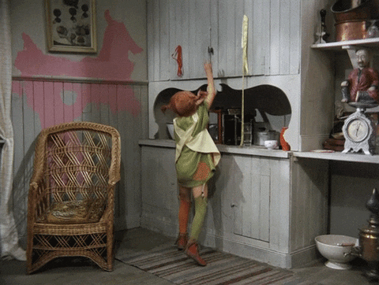
</div>
]


---
# Keeping Future-you happy

- It’s often tempting to set up a project assuming that you will be the only person working on it, e.g. as homework.
- That’s almost never true.
- Coauthors and collaborators happen to the best of us.
- Even if not, there's someone else who you always have to keep happy: Future-you.
- Future-you is really the one you organize your projects for.
- They are who you use version control for (see later).
- Most importantly, they are who will enjoy the fruits of your data science labor, or have to fight back your chaos.
- So, be kind to Future-you. Establish a good workflow. You'll thank yourself later.

--

<div align="center">


</div>


---

# Project setup

You should **always** think in terms of projects.

A project is a **self-contained unit of data science work** that can be

- Shared
- Recreated by others
- Packaged
- Dumped

--

A project contains

- Content, e.g., raw data, processed data, scripts, functions, documents and other output
- Metadata, e.g., information about tools for running it (required libraries, compilers), version history

--

For R projects

- Projects are folders/directories.
- Metadata is the [RStudio project](https://support.rstudio.com/hc/en-us/articles/200526207-Using-Projects) (`.Rproj`) files (perhaps augmented with the output of [renv](https://rstudio.github.io/renv/articles/renv.html) for dependency management) and `.git`.


---

# Setup: the folder structure

.pull-left-wide[

## Structuring your working directory

- One folder contains everything inside it.
- Directories keep things separate that should be separated.
- You decide on the fundamental structure. The project decides on the details.

## Further thoughts

- Ideally, your project folder can be relocated without problem.
- Keep input separate from output. Definitely separate raw from processed data!
- Structure should be capable of evolution. More data, cases, models, output formats shouldn't be a problem. 
]

.pull-right-small-center[
<div align="center">
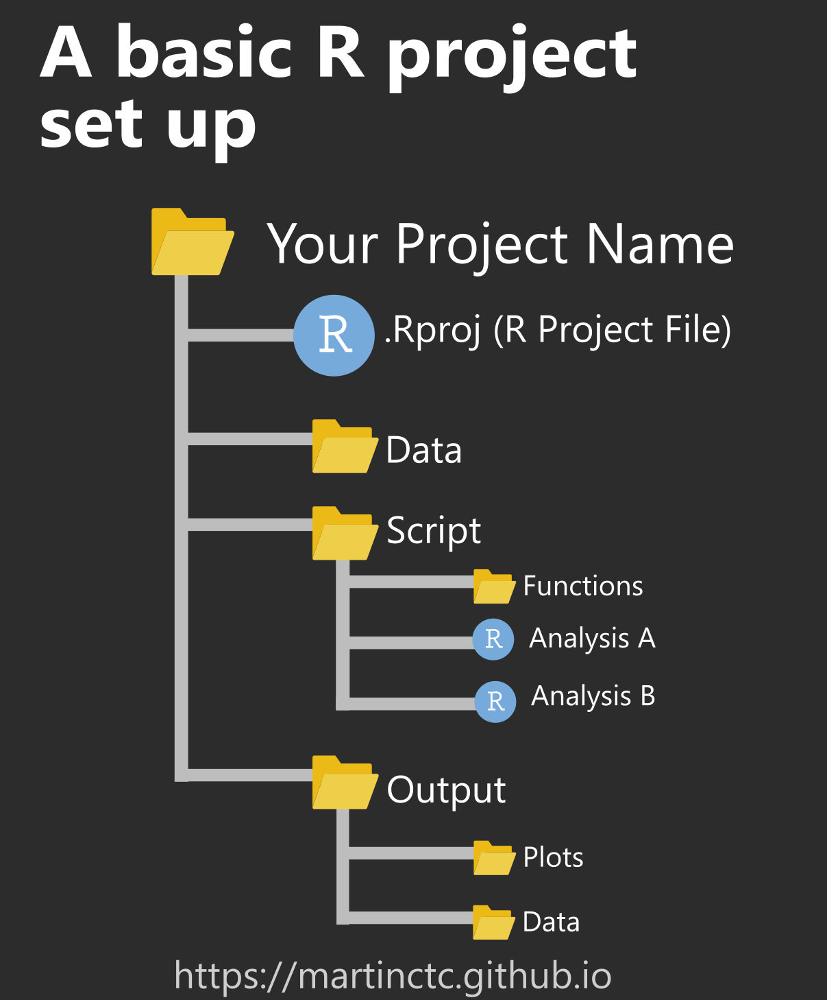
</div>
<br>
<div align="center">
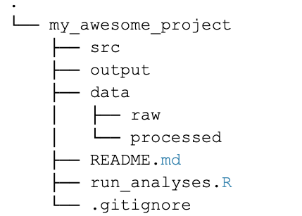
</div>
`Credit` [Chris/r-bloggers.com](https://www.r-bloggers.com/2018/08/structuring-r-projects/)
]


---

# Setup: the paths

.pull-left[
## Good paths

- All internal paths are relative.
- They are invariant to moving/sharing the project.
- Examples:
  - `"preprocessing.R"`
  - `"figures/model-1.png"`
  - `"../data/survey.RDa"`
  
## Bad paths

- Using `setwd()` is bad practice 99% of the times.
- Absolute paths are bad paths. Don't feed functions with paths like `"/Users/me/data/thing.sav"`.
- Those paths will not work outside your computer (or maybe not even there, some days/weeks/months ahead).
]

--

.pull-right[

## The working directory

- Set it manually once per session (do `Session > Set Working Directory > Choose Directory`). Then all your good paths will "just work".
- Better yet, get it right automatically by opening RStudio with clicking on the script you want to work with. This will set the location of the script as working directory (which should be your working assumption, too).
- Even better yet, have the metadata set it for you:
  - Open your session by opening (choosing, clicking on) `myproject.Rproj` 
  - Then you’ll get the path set for you. 
- That's probably better than the previous option because you might not want your `code` directory to be the working directory.
]


---

# Setup: the code structure

## Naming scripts

- Files should have short, descriptive names that indicate their purpose.
- I recommend the use of telling verbs.
- Names should only include letters and numbers with dashes `-` or underscores `_` to separate words.
- Use numbering to indicate the order in which files should be run:
  - `0-setup.R`
  - `1-import-data.R`
  - `2-preprocess-data.R`
  - `3-describe-uptake.R`
  - `4-analyze-uptake.R`
  - `5-analyze-experiment.R`
  
--

## Modularizing scripts

- Write short, modular scripts. Every script serves a purpose in your pipeline.
- This makes things easier to debug.
- At the beginning of a script you might want to document input and output.


---

# Setup: the code structure (cont.)

## Talk to Future-you

- Describe your code, e.g. by starting with a description of what it does. If you comment/describe a lot, consider using an R Markdown (`.Rmd`) file instead of a simple `.R` script.
- Put the setup first (e.g., `library()` and `source()`).
- You might want to outsource the loading of packages to a separate script that is imported in the first step (`source("functions.R")`) or just declared the first script in the pipeline.
- Always comment more than you usually do.

--

## Structuring your code

- Even with modularized code, scripts can become long. Structure helps to keep an overview.
- Use commented lines as section/subsection heads.
- RStudio creates a "table of contents" when you name your code chunks as follows (`#` followed by title and `---`):

```{r, eval = FALSE}
# Import data --------------

dat <- read_csv("dat.csv")
```


---

# Setup: the rest

.pull-left[

## More things to consider 

- There'd be more to say on how to establish a good project workflow, including how to
  - store/organize raw and derived data,
  - deal with output in form of graphs and tables,
  - link everything together from start (project setup) to finish (knitting the report)
  - separate coding for the record and experimental coding.
- But there's limited value in teaching you all that upfront.
- The truth is: You'll likely refine your own workflow over time. I just saved you some initial pain (hopefully).
- Do check out other people's experiences and opinions, e.g.,  [here](https://www.r-bloggers.com/2018/08/structuring-r-projects/) or  [here](https://kdestasio.github.io/post/r_best_practices/).

]

.pull-right-center[
<div align="center">
<br><br><br>
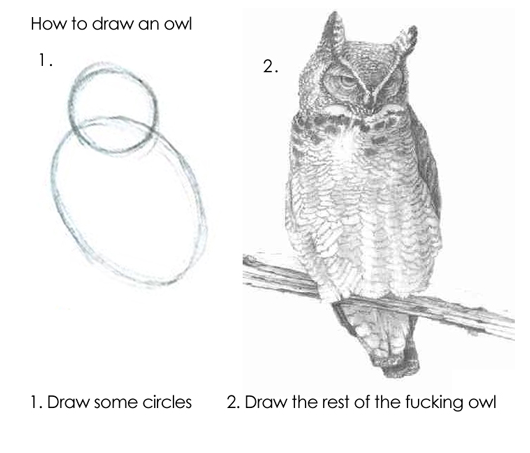
</div>
**Managing your R project in two simple steps**
]


<!-- ############################################ -->
---
class: inverse, center, middle
name: style

# Coding style

<html><div style='float:left'></div><hr color='#EB811B' size=1px style="width:1000px; margin:auto;"/></html>

---

# Coding style: the basics

### Why adhere to a particular style of coding?

- It reduces the number of arbitrary decisions you have to consciously make during coding. We make an arbitrary decision (convention) once, not always ad hoc.
- It provides consistency.
- It makes code easier to write.
- It makes code easier to read, especially in the long term (i.e. two days after you've closed a script).
	
--

### What are questions of style?

- Questions of style are a matter of opinion.
- We will mostly follow Hadley Wickham’s opinion as expressed in the "[tidyverse style guide](https://style.tidyverse.org/)".
- We'll consider how to
  - name,
  - comment,
  - structure, and
  - write.
  
---
# Naming things

## Surprisingly many things can go wrong with naming 

.pull-left-center[
<br><br><br><br>
"There are only two hard things in Computer Science: cache invalidation and naming things." - *Phil Karlton*

<br>
`Credit` [karlton.org](https://www.karlton.org/2017/12/naming-things-hard/)
]

.pull-right-center[
<div align="center">
<br>
<b></b>
<br>

<br>
</div>

`Credit` [Mashable](https://in.mashable.com/tech/13755/elon-musk-announces-the-birth-of-his-baby-in-the-most-elon-musk-way-possible)
]


---

# Naming files

- Code file names should be meaningful and end in `.R`.
- Avoid using special characters in file names. Stick with numbers, letters, dashes (`-`), and underscores (`_`).
- Some examples:

```bash
# Good
fit_models.R
utility_functions.R

# Bad
fit models.R
foo.r
stuff.r
```

- If files should be run in a particular order, prefix them with numbers: 

```bash
00_download.R
01_explore.R
...
09_model.R
10_visualize.R
```

---

# Naming objects and variables

.pull-left[
- There are various conventions of how to write phrases without spaces or punctuation. Some of these have been adapted in programming, such as [camelCase](https://en.wikipedia.org/wiki/Camel_case), [PascalCase](https://techterms.com/definition/pascalcase), or [snake_case](https://en.wikipedia.org/wiki/Snake_case).
- The [`tidyverse`](https://style.tidyverse.org/syntax.html#object-names) way: Object and variable names should use only lowercase letters, numbers, and underscores.
- Examples:

```bash
# Good
day_one # snake_case
day_1 # snake_case

# Less good
dayOne # camelCase
DayOne # PascalCase
day.one # dot.case

# Dysfunctional
day-one # kebab-case
```
]

.pull-right-center[
<div align="center">
<br>
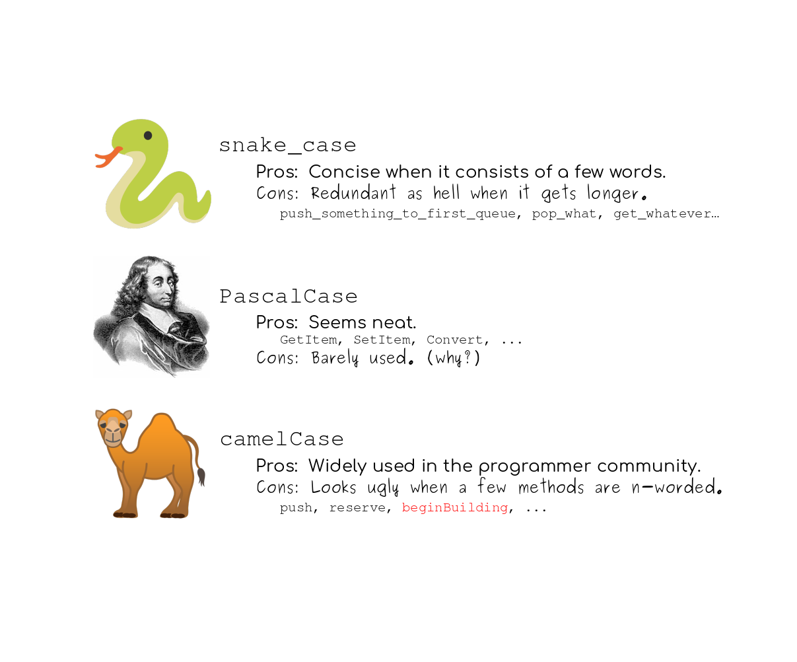
<br>
</div>

`Credit` [cassert24/Reddit](https://www.reddit.com/r/ProgrammerHumor/comments/cj5g0f/any_pascalcase_supports_out_there/)
]


---

# Naming functions

- In addition to following the general advice for object names, strive to use verbs for function names:

```bash
# Good
add_row()
permute()

# Bad
row_adder()
permutation()
```
- Also, try avoiding function names that already exist, in particular those that come with a loaded package.
- This often implies a trade-off between shortness and uniqueness. In any case, you would try to avoid situations that force you disambiguate functions with the same name (as in `dplyr::select`; see ["R packages"](https://r-pkgs.org/dependencies-mindset-background.html#sec-dependencies-namespace)).
- Check out this [Wikipedia page](https://en.wikipedia.org/wiki/Naming_convention_(programming)) or this [Stackoverflow post](https://stackoverflow.com/questions/17326185/what-are-the-different-kinds-of-cases) for more background on naming conventions in programming!
- For more good advice on how to name stuff, see [this legendary presentation](http://www2.stat.duke.edu/~rcs46/lectures_2015/01-markdown-git/slides/naming-slides/naming-slides.pdf) by Jenny Bryan.

---
# Commenting on things

.pull-left[

### Why comment at all?

- It’s often tempting to set up a project assuming that you will be the only person working on it, e.g. as homework. But that's almost never true. 
- You have project partners, co-authors, principals.
- Even if not, there's someone else who you always have to keep happy: Future-you.
- Comment often to make Future-you happy about Past-you by document what Present-You is doing/thinking/planning to do.
]

.pull-right-center[
<div align="center">
Past-you
<br>

<br>
Present-you
<br>

<br>
Future-you
<br>

<br>
</div>
]

---
# Commenting on things *cont.*

.pull-left[
### General advice

- Each line of a comment should begin with the comment symbol and a single space: `# `
- Use comments to record important findings and analysis decisions.
- If you need comments to explain what your code is doing, consider rewriting your code to be clearer. 
- But: comments can work well as "sub-headlines".
- If you discover that you have more comments than code, consider switching to R Markdown.
- (Longer) comments generally work better if they get their own line.

```{r, eval = FALSE}
# define job status
dat$at_work <- dat$job %in% c(2, 3)
dat$at_work <- dat$job %in% c(2, 3) # define job status
```
]

.pull-right[
### Giving structure

- Use commented lines together with dashes to break up your file into easily readable chunks.
- RStudio automatically detects these chunks and turns them into sections in the script outline.

```{r, eval = FALSE}
# Input/output ---------------------

# input
c("data/survey2021.csv")

#  output
c("survey_2021_cleaned.RData",
  "resp_ids.csv")

# Load data ------------------------

# Plot data ------------------------
```
]


---
# Other stuff

.pull-left[
- Use **spaces** generously, but not too generously. Always put a space after a comma, never before, just like in regular English.
- Use `<-`, not `=`, for **assignment**.
- For **logical operators**, prefer `TRUE` and `FALSE` over `T` and `F`.
- To facilitate readability, **keep your lines short**. Strive to limit your code to about 80 characters per line.
- If a **function call is too long** to fit on a single line, use one line each for the function name, each argument, and the closing bracket.
- Use **pipes**. When you use them, they should always have a space before it, and should usually be followed by a new line.
]

.pull-right[
 
**Spacing**
 
```{r, eval = FALSE} 
# Good
mean(x, na.rm = TRUE)
height <- (feet * 12) + inches

# Bad
mean(x,na.rm=TRUE) 
mean ( x, na.rm = TRUE )
height<-feet*12+inches
``` 

**Piping**
 
```{r, eval = FALSE} 
babynames %>%
  filter(name %>% equals("Kim")) %>%
  group_by(year, sex) %>%
  summarize(total = sum(n)) %>%
  qplot(year, total, color = sex, data = ., 
        geom = "line") %>%
  add(ggtitle('People named "Kim"')) %>%
  print
``` 
]


<!-- ############################################ -->
---
class: inverse, center, middle
name: debugging

# Strategies for debugging
<html><div style='float:left'></div><hr color='#EB811B' size=1px style="width:1000px; margin:auto;"/></html>


---
background-image: url("pics/debugging-female-welders.jpg")
background-size: contain
background-color: #000000

# Debugging


---
# What's debugging?

.pull-left[
### Straight from the [Wikipedia](https://en.wikipedia.org/wiki/Debugging)

"Debugging is the process of finding and resolving bugs (defects or problems that prevent correct operation) within computer programs, software, or systems."

### A famous (yet not the first) bug:

The term "bug" was used in an account by computer pioneer [Grace Hopper](https://en.wikipedia.org/wiki/Grace_Hopper) (see on the right). While she was working on a [Mark II](https://en.wikipedia.org/wiki/Harvard_Mark_II) computer at Harvard University, her associates discovered a moth stuck in a relay and thereby impeding operation, whereupon she remarked that they were "debugging" the system. This bug was carefully removed and taped to the log book (see on the right).
]

.pull-right-center[
<div align="center">
<br>

<br>
<i>Above:</i> Grace Hopper, <i>Below:</i> The bug
<br>
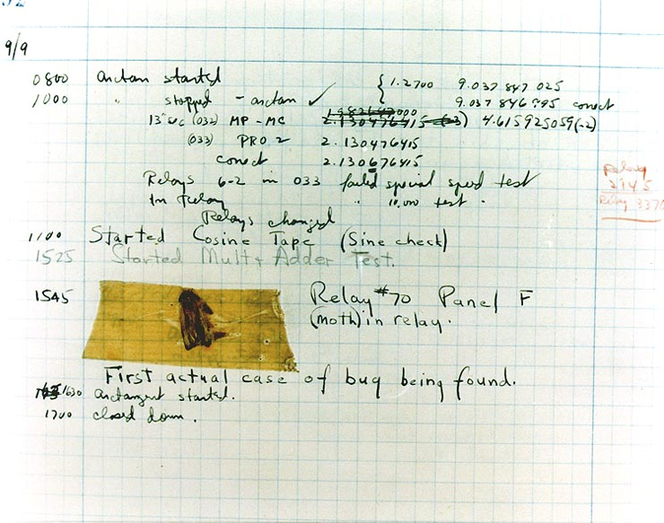 
</div>
]


---
# Why debugging matters

.pull-left-wide[
The Wikipedia [list of software bugs](https://en.wikipedia.org/wiki/List_of_software_bugs) with significant consequences is growing and you don't want to be on it. 

NASA software engineers are [famous for producing bug-free code](https://www.bugsplat.com/blog/less-serious/why-nasa-code-doesnt-crash/). This was learned the hard and costly way though. Some highlights from space:

- 1962: A booster went off course during launch, resulting in the [destruction of NASA Mariner 1](https://www.youtube.com/watch?v=CkOOazEJcUc) . This was the result of the failure of a transcriber to notice an overbar in a handwritten specification for the guidance program, resulting in an incorrect formula the FORTRAN code.
- 1999: [NASA's Mars Climate Orbiter was destroyed](https://www.youtube.com/watch?v=lcYkOh4nweE), due to software on the ground generating commands based on parameters in pound-force (lbf) rather than newtons (N)
- 2004: [NASA's Spirit rover became unresponsive](https://www.youtube.com/watch?v=7V54LRRJaGk) on January 21, 2004, a few weeks after landing on Mars. Engineers found that too many files had accumulated in the rover's flash memory (the problem could be fixed though by deleting unnecessary files, and the Rover lived happily ever after. Until it [froze to death in 2011](https://en.wikipedia.org/wiki/Spirit_(rover)).
]

.pull-right-small[
<div align="center">
<br><br>


</div>
]


---
# Why debugging matters (cont.)

<div align="center">
<br>

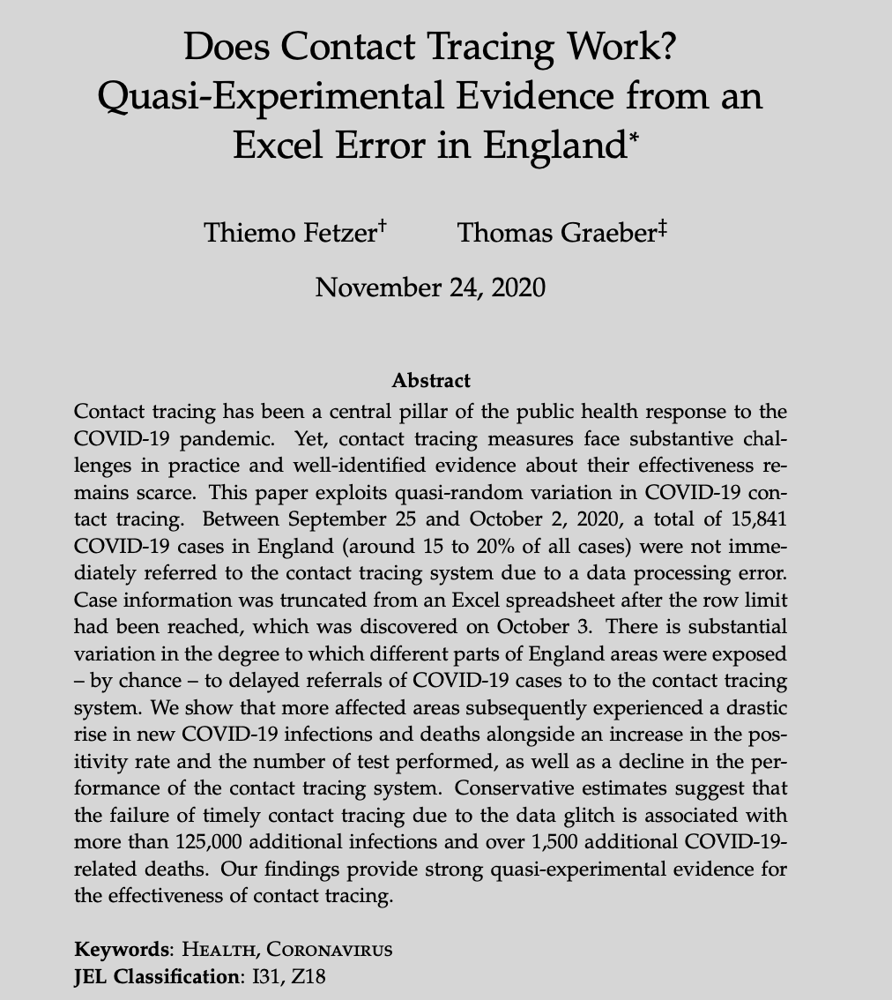
</div>


---
# Why debugging matters (cont.)

.pull-left-center[
<div align="center">
<br>
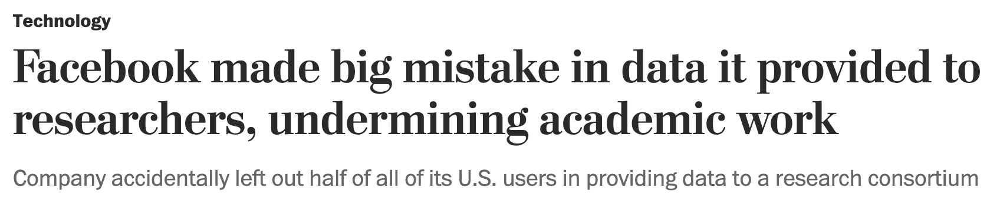
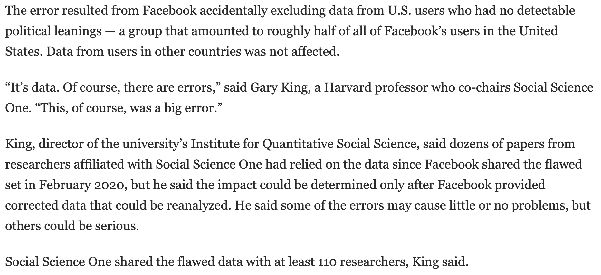
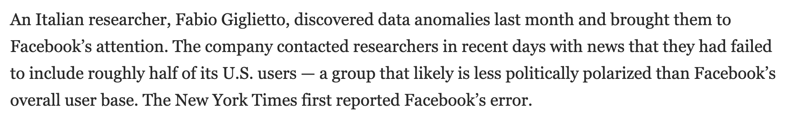
</div>
`Source` [Washington Post](https://www.washingtonpost.com/technology/2021/09/10/facebook-error-data-social-scientists/)
]


.pull-right-center[
<div align="center">
<br>
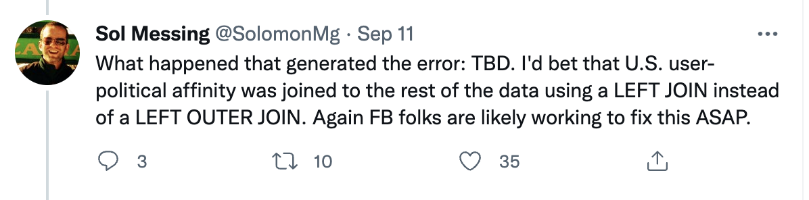
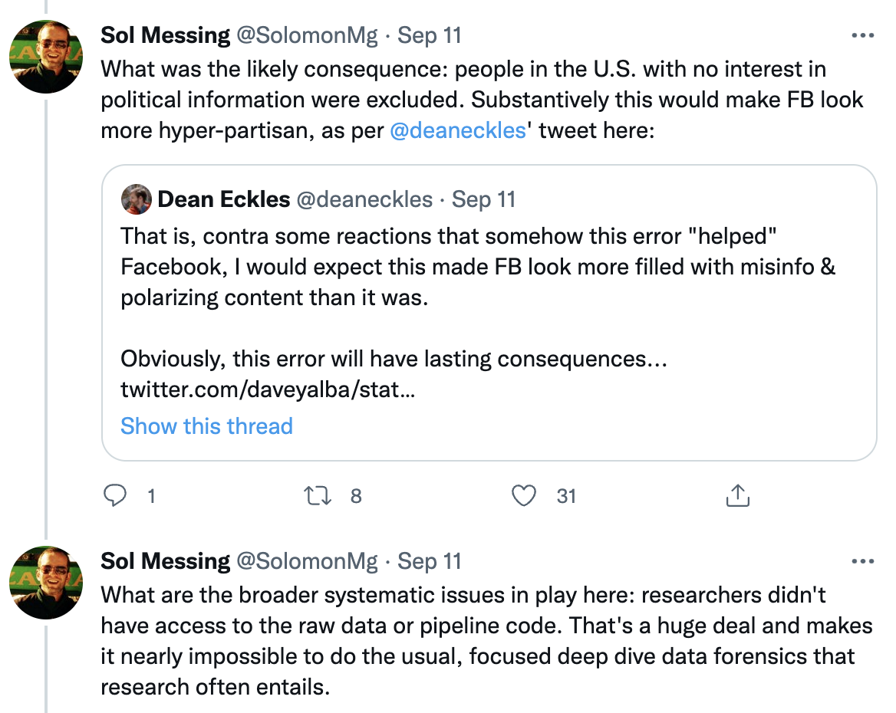
</div>
`Source` [Solomon Messing / Twitter](https://twitter.com/solomonmg/status/1436742352039669760)
]


---
# A general strategy for debugging

.pull-left-vsmall[]

.pull-right-wide[
<br>
<br>
<br>

## 1. Google

## 2. Reset

## 3. Debug

## 4. Deter
]


---
# Google

.footnote[<sup>1</sup>Do you get an error message you don't understand? That's good news actually, because the really nasty bugs come without errors. ]

.pull-left-wide2[
According to [this analysis](https://github.com/noamross/zero-dependency-problems/blob/master/misc/stack-overflow-common-r-errors.md), the most common error types in R are:<sup>1</sup>

1. `Could not find function` errors, usually caused by typos or not loading a required package.
2. `Error in if` errors, caused by non-logical data or missing values passed to R's `if` conditional statement.
3. `Error in eval` errors, caused by references to objects that don't exist.
4. `Cannot open` errors, caused by attempts to read a file that doesn't exist or can't be accessed.
5. `no applicable method` errors, caused by using an object-oriented function on a data type it doesn't support.
6. `subscript out of bounds` errors, caused by trying to access an element or dimension that doesn't exist
7. Errors caused by failing to install/compile/load a package.
]

--

.pull-right-small2[
Whenever you see an error message, start by [googling](https://lmgtfy.app/?q=Error+in+interpretative_method+%3A+%20+%20could+not+find+function+%22interpretative_method%22&iie=1) it. Improve your chances of a good match by removing any variable names or values that are specific to your problem. Also, look for [Stack Overflow](https://stackoverflow.com/questions/tagged/r) posts and list of answers.

<div align="center">
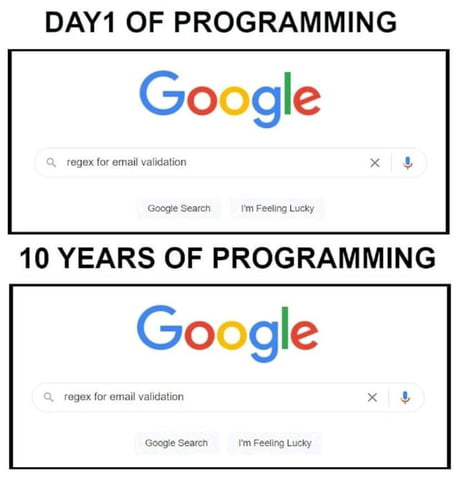
</div>

]


---
# Reset

.pull-left[
- If at first you don't succeed, try exactly the same thing again.
- Have you tried turning it off and on again?
- Do you use `rm(list = ls())`? Don't. Packages remain loaded, options and environment variables set, ... all possible sources of error!
- A fresh start clears the workspace, resets options, environment variables, and the path.
- While we're at it, check out James Wade's advice ["How I set up RStudio for Efficient Coding" (YouTube)](https://www.youtube.com/watch?v=p-r-AWR3-Es).
]

.pull-right[
<div align="center">
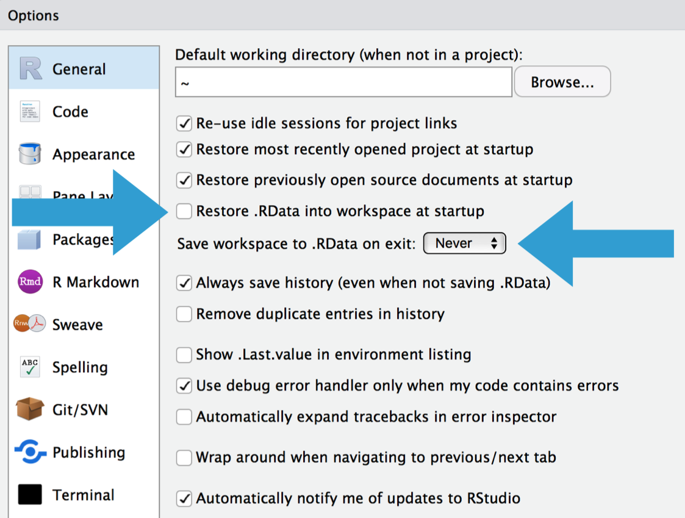<br>
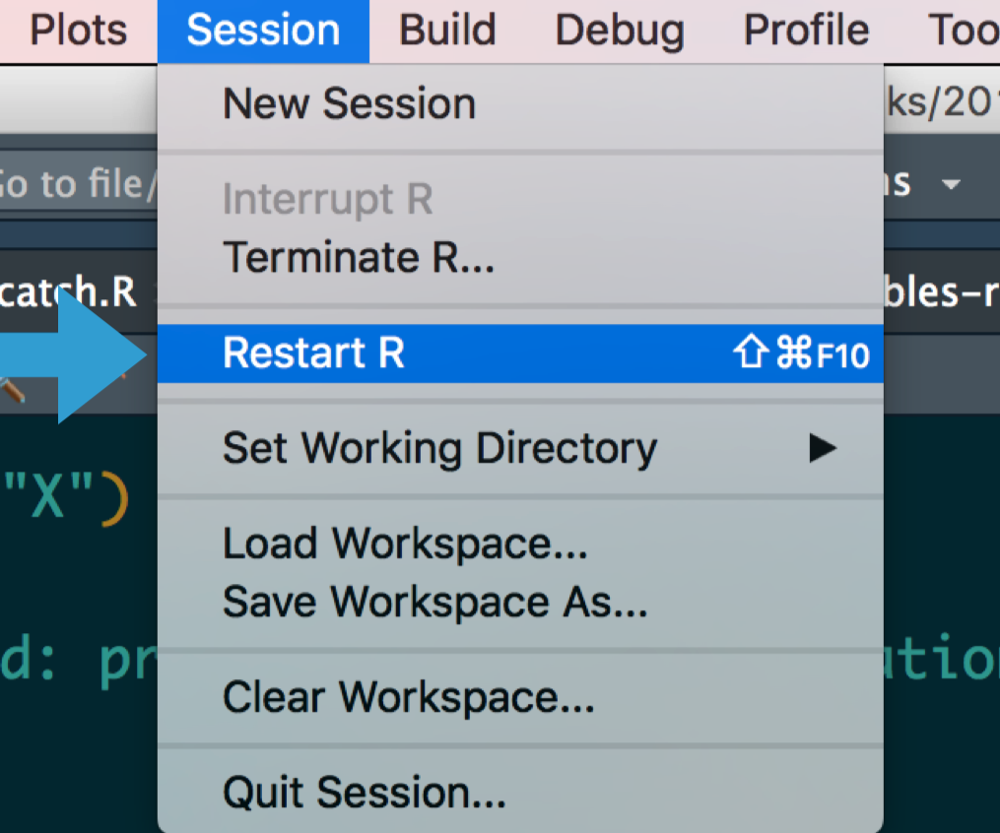
</div>
]


---
# Debug

### Make the error repeatable. 

- Execute the code many times as you consider and reject hypotheses. To make that iteration as quick possible, it’s worth some upfront investment to make the problem both easy and fast to reproduce.
- Work with reproducible and minimal examples by removing innocuous code and simplifying data.
- Consider automated testing. Add some nearby tests to ensure that existing good behaviour is preserved. 

### Track the error down.

- Execute code step by step and inspect intermediate outputs. 
- Adopt the scientific method: Generate hypotheses, design experiments to test them, and record your results. 

### Once found, fix the error and test it.

- Ensure you haven’t introduced any new bugs in the process. 
- Make sure to carefully record the correct output, and check against the inputs that previously failed.
- Reset and run again to make sure everything still works. 


---
# Deter

.pull-left-wide2[

### Defensive programming

- **Pay attention.** Do results make sense? Do they look different from previous results? Why?
- **Know what you're doing**, and what you're expecting.
  - Avoid functions that return different types of output depending on their input, e.g., `[]` and `sapply()`.
  - Be strict about what you accept (e.g., only scalars). 
  - Avoid functions that use non-standard evaluation (e.g., `with()`)
- **Fail fast**.
  - As soon as something wrong is discovered, signal an error. 
  - Add tests (e.g., with the `testthat` package).
  - Practice good condition/exception handling, e.g., with `try()` and `tryCatch()`. 
  - Write error messages for humans.

]

.pull-right-small3[
### Transparency

- Collaborate! [Pair programming](https://en.wikipedia.org/wiki/Pair_programming) is an established software development technique that increases code robustness. It also works [from remote](https://ivelasq.rbind.io/blog/vscode-live-share/).
- Be transparent! Let others access your code and comment on it.

<div align="center">
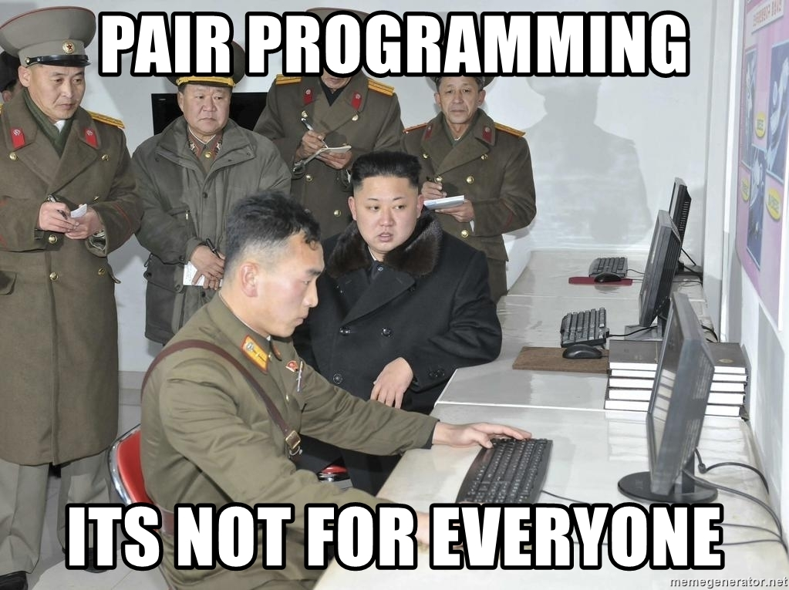
</div>
]


---
# Debugging R: What you get

<br>
<br>
<tt>
Error : .onLoad failed in loadNamespace() for 'rJava', details: <br>
call: dyn.load(file, DLLpath = DLLpath, ...) <br>
error: unable to load shared object '/Users/janedoe/Library/R/3.6/library/rJava/libs/rJava.so':  <br>
libjvm.so: cannot open shared object file: No such file or directory  <br>
Error: loading failed  <br>
Execution halted  <br>
ERROR: loading failed  <br>
* removing '/Users/janedoe/Library/R/3.6/library/rJava/' <br>
Warning in install.packages : <br>
installation of package 'rJava' had non-zero exit status
</tt>

<br>
`Credit` [Jenny Bryan](https://github.com/jennybc/debugging)


---
# Debugging R: What you see


<br>
<br>
<tt>
<span style = "color:red">Error</span> : blah <span style = "color:red">failed</span> blah blah() blah 'blah', blah: <br>
call: blah.blah(blah, blah = blah, ...) <br>
<span style = "color:red">error</span>: <span style = "color:red">unable</span> to blah blah blah '/blah/blah/blah/blah/blah/blah/blah/blah/blah.so':  <br>
blah.so: <span style = "color:red">cannot</span> open blah blah blah: <span style = "color:red">No</span> blah blah blah blah  <br>
<span style = "color:red">Error</span>: blah <span style = "color:red">failed</span>  <br>
blah blah  <br>
<span style = "color:red">ERROR</span>: blah <span style = "color:red">failed</span>  <br>
* removing '/blah/blah/blah/blah/blah/blah/blah/' <br>
<span style = "color:red">Warning</span> in blah.blah : <br>
blah of blah 'blah' blah blah-blah blah blah
</tt>

<br>
`Credit` [Jenny Bryan](https://github.com/jennybc/debugging)


---
# Strategies to debug your R code

Sometimes the mistake in your code is hard to diagnose, and googling doesn't help. Here are a couple of strategies to debug your code:

- Use `traceback()` to determine where a given error is occurring.

- Output diagnostic information in code with `print()`, `cat()` or `message()` statements.

- Use `browser()` to open an interactive debugger before the error

- Use `debug()` to automatically open a debugger at the start of a function call.

- Use `trace()` to make temporary code modifications inside a function that you don't have easy access to.


---
# Locating errors with traceback()

.pull-left[

### Motivation and usage
- When an error occurs with an unidentifiable error message or an error message that you are in principle familiar with but cannot locate its sources, the `traceback()` function comes in handy.
- The `traceback()` function prints the sequence of calls that led to an uncaught error.
- The `traceback()` output reads from bottom to top.
- Note that errors caught via `try()` or `tryCatch()` do not generate a traceback!
-  If you’re calling code that you `source()`d into R, the traceback will also display the location of the function, in the form `filename.r#linenumber`. 
]

--

.pull-right[
### Example

In the call sequence below, the execution of `g()` triggers an error:

```{r, eval = FALSE}
f <- function(x) x + 1
g <- function(x) f(x)
g("a")
```

```r 
#> Error in x + 1 : non-numeric argument to binary operator
```

Doing the traceback reveals that the function call f(x) is what lead to the error:

```{r, eval = FALSE}
traceback()
```

```r 
#> 2: f(x) at #1
#> 1: g("a")
```
]

---
# Interactive debugging with browser()

.pull-left[
### Motivation and usage
- Sometimes, you need more information than the precise location of an error in a function to fix it. 
- The interactive debugger lets you pause the run of a function and interactively explore its state.
- Two options to enter the interactive debugger: 
  1. Through RStudio's "Rerun with Debug" tool, shown to the right of an error message.
  2. You can insert a call to `browser()` into the function at the stage where you want to pause, and re-run the function.
- In either case, you’ll end up in an interactive environment inside the function where you can run arbitrary R code to explore the current state. You’ll know when you’re in the interactive debugger because you get a special prompt, `Browse[1]>`. 
]

--

.pull-right[
### Example

```{r, eval = FALSE}
h <- function(x) x + 3
g <- function(b) {
  browser() #<<
  h(b)
}
g(10)
```

Some useful things to do are:

1. Use `ls()` to determine what objects are available in the current
   environment.
2. Use `str()`, `print()` etc. to examine the objects.
3. Use `n` to evaluate the next statement.
4. Use `s`: like `n` but also step into function calls.
5. Use `where` to print a stack trace (→ traceback).
6. Use `c` to exit debugger and continue execution.
7. Use `Q` to exit debugger and return to the R prompt.
]


---
# Debugging other peoples' code


.pull-left[
### Motivation
- Sometimes the error is outside your code in a package you're using, you might still want to be able to debug.
- Two options:
  1. Get a local version of the package code and debug as if it were your own.
  2. Use functions which which allow you to start a browser in existing functions, including `recover()` and `debug()`.
]

.pull-right[
]


---
# Debugging other peoples' code (cont.)

.pull-left-small[
### Motivation
- `recover()` serves as an alternative error handler which you activate by calling `options(error = recover)`.
- You can then select from a list of current calls to browse.
- `options(error = NULL)` turns off this debugging mode again.
- A simpler alternative is `options(error = browser)`, but this only allows you to browse the call where the error occurred.
]

--

.pull-right-wide[
### Example

- Activate debugging mode; then execute (flawed) function:

```{r, eval = FALSE}
options(error = recover) #<<
lm(mpg ~ wt, data = "mtcars")
```

```r 
Error in model.frame.default(formula = mpg ~ wt, data = "mtcars", drop.unused.levels = TRUE) 
 'data' must be a data.frame, environment, or list
 
Enter a frame number, or 0 to exit   

1: lm(mpg ~ wt, data = "mtcars")
2: eval(mf, parent.frame())
3: eval(mf, parent.frame())

Selection: 
```

- Deactivate debugging mode: 

```{r, eval = FALSE}
options(error = NULL) #<<
```
]

---
# Debugging other peoples' code (cont.)

.pull-left[
### Motivation
- `debug()` activates the debugger on any function, including those in packages (see on the right). `undebug()` deactivates the debugger again.
- Some functions in another package are easier to find than others. There are
  - *exported* functions which are available outside of a package and
  - *internal* functions which are only available within a package.
- To find (and debug) exported functions, use the `::` syntax, as in `ggplot2::ggplot`.
- To find un-exported functions, use the `:::` syntax, as in `ggplot2:::check_required_aesthetics`.
]

--

.pull-right[
### Example

- Activate debugging mode for `lm()` function; then execute function:

```{r, eval = FALSE}
debug(stats::lm) #<<
lm(mpg ~ weight, data = "mtcars")
```

- Interactive debugging mode for `lm()` is entered; use the common `browser()` functionality to navigate:

```r 
debugging in: lm(mpg ~ weight, data = mtcars)
debug: {
    ret.x <- x
    ...
Browse[2]> 
```

- Deactivate debugging mode: 

```{r, eval = FALSE}
undebug(stats::lm) #<<
```
]


---
# Debugging in RStudio

<div align="center">
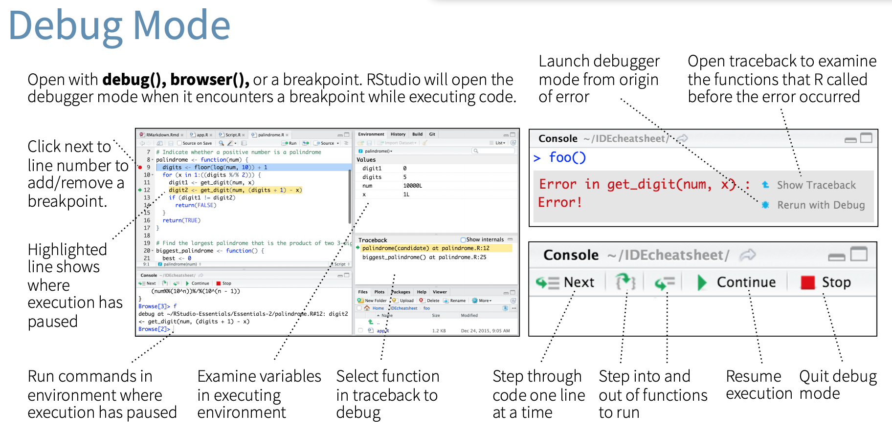
</div>


---
# More on debugging R

.pull-left[
<br><br><br>

### Further reading

- [12-minute video](https://vimeo.com/99375765) on debugging in R
- Jenny Bryan's [talk on debugging](https://github.com/jennybc/debugging) at  rstudio::conf 2020
- Jenny Bryan and Jim Hester's "What They Forgot to Teach You About R", Chapter 11: [Debugging R code](https://rstats.wtf/debugging-r)
- Jonathan McPherson's [Debugging with RStudio](https://support.rstudio.com/hc/en-us/articles/205612627-Debugging-with-RStudio)
]

.pull-right[
<br>
<div align="center">
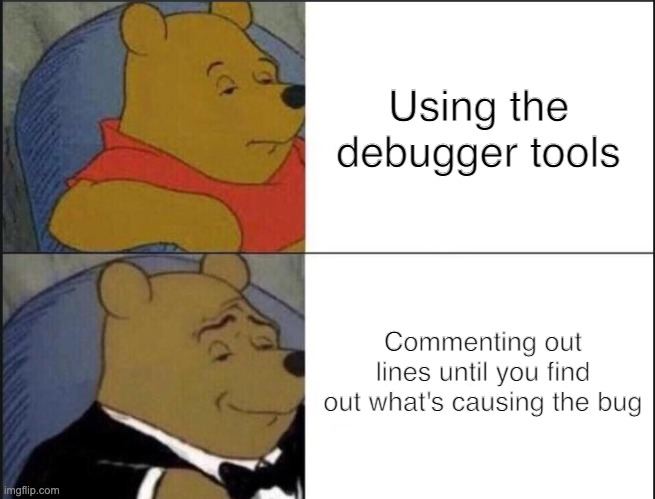
</div>
]


---
# Next steps

<br>

### Assignment

Assignment 1 is online! You have a bit more than a week to work on it.

### Next lecture

**Programming II** Buckle up and bring coffee, because it'll get both exciting and tedious at the same time. We're going to iterate, automate, and schedule.


