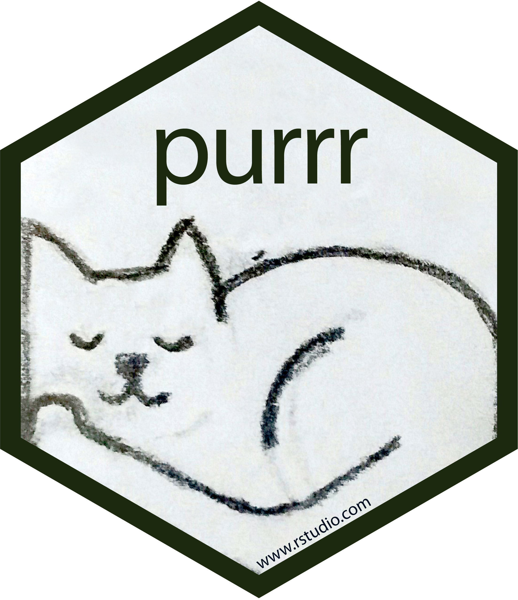
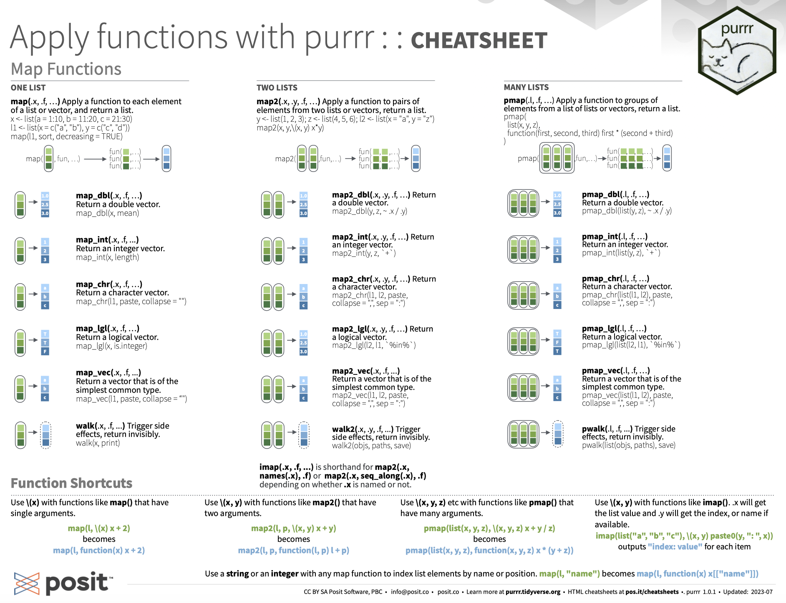
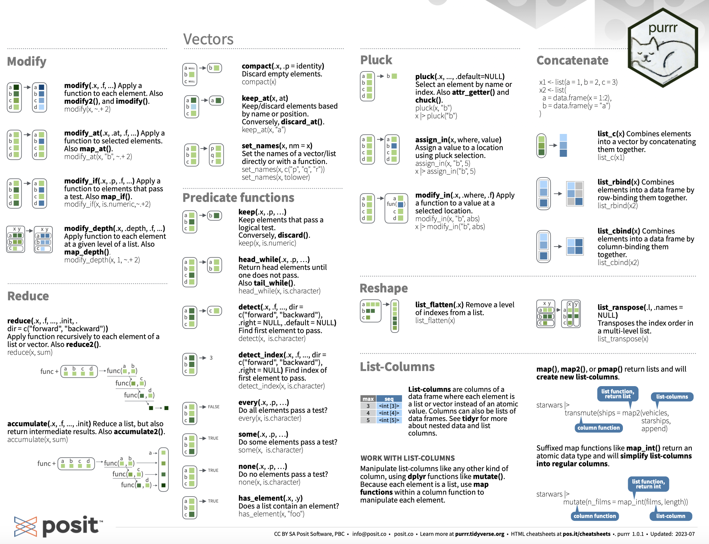
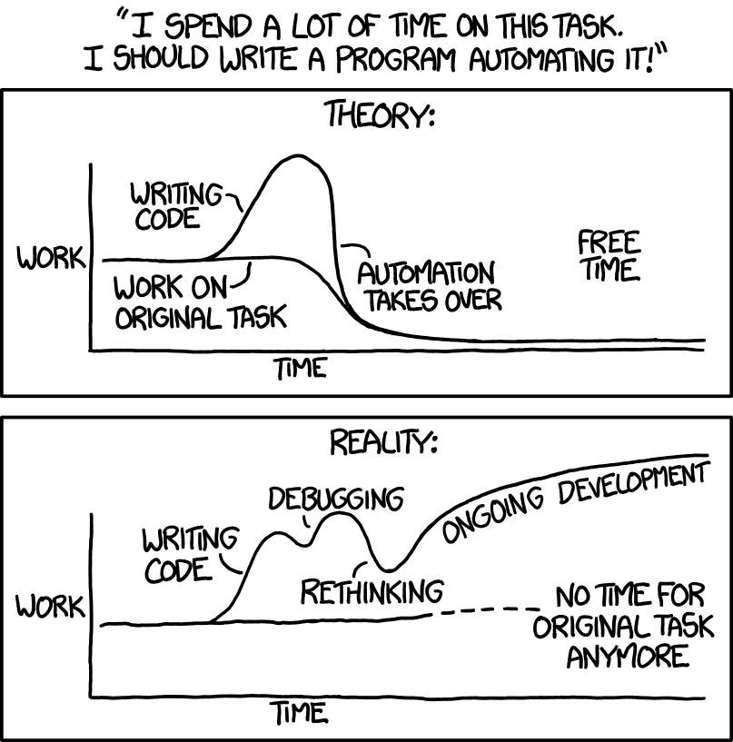
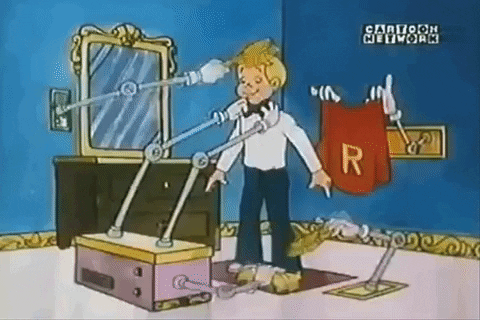
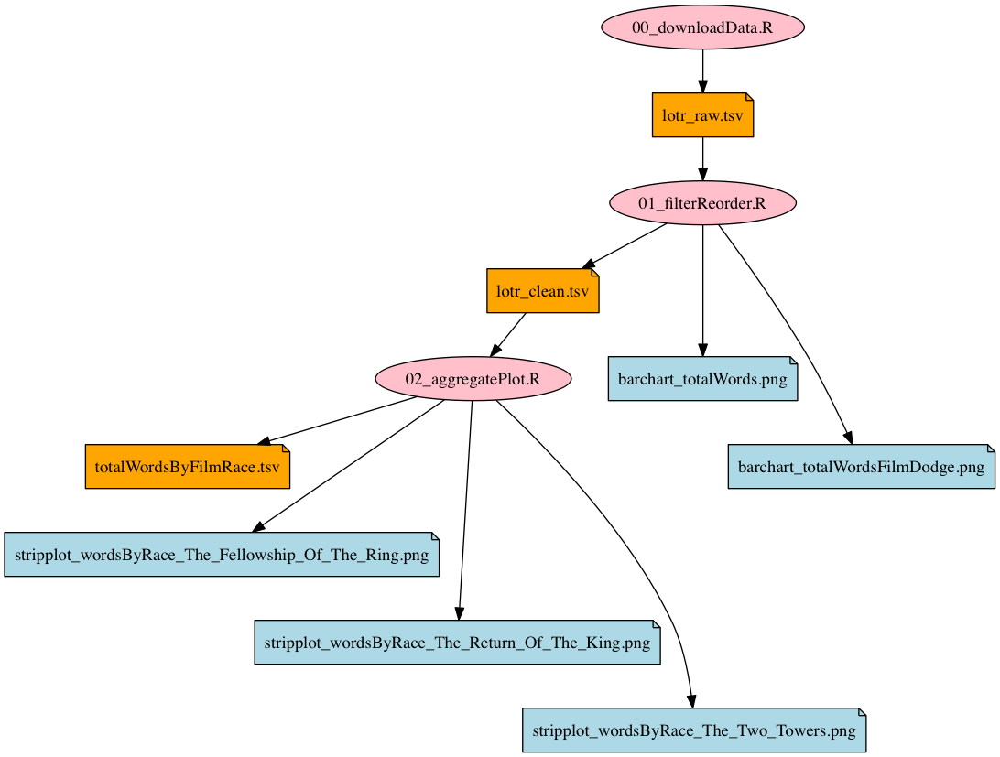
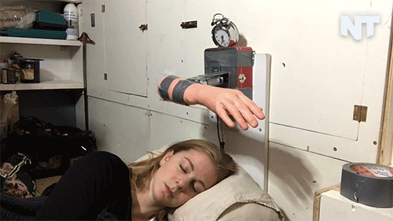
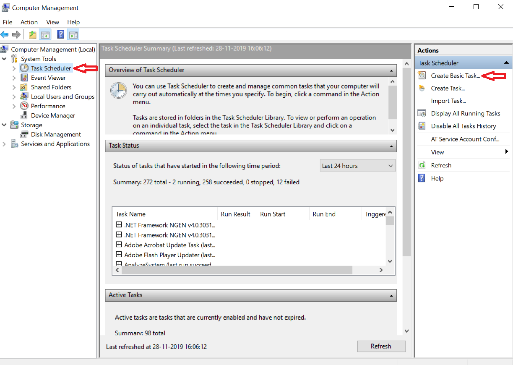
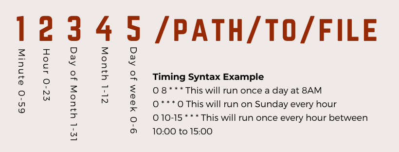

```{css, echo=FALSE} 
@media print { # print out incremental slides; see https://stackoverflow.com/questions/56373198/get-xaringan-incremental-animations-to-print-to-pdf/56374619#56374619
  .has-continuation {
    display: block !important;
  }
}
```

```{r setup, include=FALSE}
# figures formatting setup
options(htmltools.dir.version = FALSE)
library(knitr)
opts_chunk$set(
  comment = "  ",
  prompt = T,
  fig.align="center", #fig.width=6, fig.height=4.5, 
  # out.width="748px", #out.length="520.75px",
  dpi=300, #fig.path='Figs/',
  cache=F, #echo=F, warning=F, message=F
  engine.opts = list(bash = "-l")
  )

## Next hook based on this SO answer: https://stackoverflow.com/a/39025054
knit_hooks$set(
  prompt = function(before, options, envir) {
    options(
      prompt = if (options$engine %in% c('sh','bash')) '$ ' else 'R> ',
      continue = if (options$engine %in% c('sh','bash')) '$ ' else '+ '
      )
})

library(tidyverse)
library(nycflights13)
library(kableExtra)
```


# Table of contents

<br>


1. [Iteration](#iteration)

2. [Automation and scripting](#automation)

3. [Scheduling](#scheduling)


<!-- ############################################ -->
---
class: inverse, center, middle
name: iteration

# Iteration

<html><div style='float:left'></div><hr color='#EB811B' size=1px style="width:1000px; margin:auto;"/></html>

---
background-image: url("pics/iteration-ford-assembly-line-1913.jpg")
background-size: contain
background-color: #000000

# Iteration


---

# Iteration

### The ubiquity of iteration

- Often we have to run the same task over and over again, with minor variations. Examples:
  - Standardize values of a variable
  - Recode all numeric variables in a dataset
  - Running multiple models with varying covariate sets
- A benefit of scripting languages in data (as opposed to point-and-click solutions) is that we can easily automate the process of iteration

--

### Ways to iterate

- A simple approach is to copy-and-paste code with minor modifications (→ "[duplicate code](https://en.wikipedia.org/wiki/Duplicate_code)", → "[copy-and-paste programming](https://en.wikipedia.org/wiki/Copy-and-paste_programming)"). This is lazy, error-prone, not very efficient, and violates the "[Don't repeat yourself](https://en.wikipedia.org/wiki/Don%27t_repeat_yourself)" (DRY) principle. 
- In R, [vectorization](https://adv-r.hadley.nz/perf-improve.html#vectorise), that is applying a function to every element of a vector at once, already does a good share of iteration for us.
- `for()` [loops](https://r4ds.hadley.nz/iteration.html) are intuitive and straightforward to build, but sometimes not very efficient.
- Finally, we learned about functions. Now, we learn how to unleash their power by applying them to anything we interact with in R at scale.


---
# A simple example

.pull-left[

## Task

Say we want to double each element in a numeric vector, `x = c(1, 2, 3, 4, 5)`. Here are some different approaches to achieve this:

### 1. Manually (sometimes: copying and pasting code)

```{r}
x <- c(1, 2, 3, 4, 5)
x_doubled <- c(2, 4, 6, 8, 10)
```

### 2. Vectorization

```{r}
x <- c(1, 2, 3, 4, 5)
x_doubled <- x * 2
x_doubled
```
]

--

.pull-right[
### 3. `for()` loop

```{r}
x <- c(1, 2, 3, 4, 5)
x_doubled <- numeric(length(x))
for (i in seq_along(x)) {
  x_doubled[i] <- x[i] * 2
}
x_doubled
```

### 4. Using `purrr`

```{r}
library(purrr)
x <- c(1, 2, 3, 4, 5)
x_doubled <- map_dbl(x, ~ .x * 2)
x_doubled
```
]


---

# Iteration with purrr

.pull-left-wide[

### The tidyverse way to iterate

- For *real* functional programming in base R, we can use the `*apply()` family of functions (`lapply()`, `sapply()`, etc.). See [here](https://nsaunders.wordpress.com/2010/08/20/a-brief-introduction-to-apply-in-r/) for an excellent summary.
- In the tidyverse, this functionality comes with the `purrr` package.
- At its core is the `map*()` family of functions. 


### How `purrr` works

- The idea is always to **apply** a function to **x**, where x can be a list, vector, data.frame, or something more complex. 
- The output is then returned as output of a pre-defined type (e.g., a list).
]

.pull-right-small-center[
<div align="center">
<br>

</div>
]

---

# Iteration with purrr: map()

The `map*()` functions all follow a similar syntax:

<div align="center">
`map(.x, .f, ...)`
</div>

We use it to apply a function `.f` to each piece in `.x`. Additional arguments to `.f` can be passed on in `...`.

--

For instance, if we want to identify the object class of every column of a data.frame, we can write:

```{r}
map(starwars, class)
```


---

# Iteration with purrr: map() *cont.*

By default, `map()` returns a list. But we can also use other `map*()` functions to give us an atomic vector of an indicated type (e.g., `map_int()` to return an integer vector, or `map_vec()` to return a vector that is the simplest common type).

Going back to the previous example, we can also use `map_chr()`, which returns a character vector:

```{r}
map_chr(starwars, class)
```

--

The `purrr` function set is quite comprehensive. Be sure to check out the [cheat sheet](https://github.com/rstudio/cheatsheets/blob/master/purrr.pdf) and the [tutorials](https://jennybc.github.io/purrr-tutorial/index.html). You'll survive without `purrr` but you probably don't want to live without it. Together with `dplyr` it's easily the most powerful package for data wrangling in the tidyverse. If you master it, it will save you a lot of time and headaches.


---

# Iteration with purrr: map() *cont.*

<div align="center">

</div>

---

# Iteration with purrr: map() *cont.*

<div align="center">

</div>


---
# Another example

.pull-left[
## Task

Let's say we want to calculate the mean and standard deviation of height and mass for each species in the `starwars` dataset.

```{r}
# Load the starwars dataset
data(starwars)

# Custom function for calculations
calc_stats <- function(df) {
  df %>%
    summarise(
      height_mean = mean(height, na.rm = TRUE),
      height_sd = sd(height, na.rm = TRUE),
      mass_mean = mean(mass, na.rm = TRUE),
      mass_sd = sd(mass, na.rm = TRUE)
    )
}
```
]

--

.pull-right[
```{r}
# Group by species and apply the custom function
species_stats <- starwars %>%
  group_by(species) %>%
  nest() # Nesting the data
species_stats
```
]


---
# Another example

.pull-left[
## Task

Let's say we want to calculate the mean and standard deviation of height and mass for each species in the `starwars` dataset.

```{r}
# Load the starwars dataset
data(starwars)

# Custom function for calculations
calc_stats <- function(df) {
  df %>%
    summarise(
      height_mean = mean(height, na.rm = TRUE),
      height_sd = sd(height, na.rm = TRUE),
      mass_mean = mean(mass, na.rm = TRUE),
      mass_sd = sd(mass, na.rm = TRUE)
    )
}
```
]

.pull-right[
```{r}
# Group by species and apply the custom function
species_stats <- starwars %>%
  group_by(species) %>%
  nest() %>% # Nesting the data
  # purrr magic
  mutate(stats = map(data, calc_stats))
species_stats
```
]

---
# Another example

.pull-left[
## Task

Let's say we want to calculate the mean and standard deviation of height and mass for each species in the `starwars` dataset.

```{r}
# Load the starwars dataset
data(starwars)

# Custom function for calculations
calc_stats <- function(df) {
  df %>%
    summarise(
      height_mean = mean(height, na.rm = TRUE),
      height_sd = sd(height, na.rm = TRUE),
      mass_mean = mean(mass, na.rm = TRUE),
      mass_sd = sd(mass, na.rm = TRUE)
    )
}
```
]

.pull-right[
```{r}
# Group by species and apply the custom function
species_stats <- starwars %>%
  group_by(species) %>%
  nest() %>% # Nesting the data
  # purrr magic
  mutate(stats = map(data, calc_stats)) %>% 
  select(species, stats) %>% # Select columns
  unnest(stats) # Unnest the data
species_stats
```
]


<!-- ############################################ -->
---
class: inverse, center, middle
name: automation

# Automation and scripting
<html><div style='float:left'></div><hr color='#EB811B' size=1px style="width:1000px; margin:auto;"/></html>


---
background-image: url("pics/automation-press-room.jpg")
background-size: contain
background-color: #000000

# Automation


---
# Automation

<div align="center">

<br>
<tt>Credit</tt> <a href="https://xkcd.com/1319/">Randall Munroe/xkcd 1319</a>
</div>

---
# Automation

.pull-left-wide2[
### Motivation

- We spend [too much time](https://itchronicles.com/technology/repetitive-tasks-cost-5-trillion-annually/) on repetitive tasks.
- We're already automating using scripts that bundle multiple commands! Next step: The pipeline as a series of scripts and commands.
- Good pipelines are modular. But you don't want to trigger 10 scripts sequentially by hand.
- Some tasks are to be repeated on a regular basis (schedule).

### When automation makes sense

- The input is variable but the process of turning input into output is highly standardized.
- You use a diverse set of software to produce the output.
- Others (humans, machines) are supposed to run the analyses.
- Time saved by automation >> Time needed to automate.
]

.pull-right-small2[
### Different ways of doing it

We will consider automation

- using **R**,
- using the **Shell** and **RScript**,
- using **make**, and
- using dedicated **scheduling tools**.

<div align="center">

</div>
]


---
# Thinking in pipelines

.pull-left[
### Key characteristics
- Pipelines make complex projects easier to handle because they break up a monolithic script into **discrete, manageable chunks**.
- If properly done, each stage of the pipeline defines its input and its outputs.
- Pipeline modules **do not modify their inputs** (*idempotence*). Rerunning one module produces the same results as the previous run.

### Key advantages
- When you modify one stage of the pipeline, you only have to rerun the downstream, dependent stages.
- Division of labor is straightforward.
- Modules tend to be a lot easier to debug.
]

.pull-right[
<br>
<div align="center">

</div>
]


---
# A data science pipeline is a graph

.pull-left-small2[
### Wait what
- Scripts and data files are vertices of the graph.
- Dependencies between stages are edges of the graph.
- Pipelines are not necessarily DAGS. Recursive routines are imaginable (but to be avoided?).
- Also, scripts are not necessarily hierarchical (e.g., multiple different modeling approaches of the same data in different scripts).
- An automation script gives *one* order in which you can successfully run the pipeline.
]

.pull-right-wide2[
<br>
<div align="center">

</div>
]


---
# An example pipeline

.pull-left-small[
In the following, we will work with this toy pipeline:<sup>1</sup>

.footnote[<sup>1</sup>Courtesy of [Jenny Bryan](https://github.com/STAT545-UBC/STAT545-UBC-original-website).]
]


.pull-right-wide[
]


---
# An example pipeline

.pull-left-small[
In the following, we will work with this toy pipeline:

- `00-packages.R` loads the packages necessary for analysis,
]

.pull-right-wide[
`00-packages.R`: 

```{r, eval = FALSE}
# install packages from CRAN
p_needed <- c("tidyverse" # tidyverse packages
)
packages <- rownames(installed.packages())
p_to_install <- p_needed[!(p_needed %in% packages)]
if (length(p_to_install) > 0) {
  install.packages(p_to_install)
}
lapply(p_needed, require, character.only = TRUE)
```
]

---
# An example pipeline

.pull-left-small[
In the following, we will work with this toy pipeline:

- `00-packages.R` loads the packages necessary for analysis,
- `01-download-data.R` downloads a spreadsheet, which is stored as `lotr_raw.tsv`,
]

.pull-right-wide[
`01-download-data.R`: 

```{r, eval = FALSE}
## download raw data
download.file(url = "http://bit.ly/lotr_raw-tsv", 
               destfile = "lotr_raw.tsv")
```
]


---
# An example pipeline

.pull-left-small[
In the following, we will work with this toy pipeline:

- `00-packages.R` loads the packages necessary for analysis,
- `01-download-data.R` downloads a spreadsheet, which is stored as `lotr_raw.tsv`,
- `02-process-data.R` imports and processes the data and exports a clean spreadsheet as `lotr_clean.tsv`, and
]

.pull-right-wide[
`02-process-data.R`: 

```{r, eval = FALSE}
## import raw data
lotr_dat <- read_tsv("lotr_raw.tsv")

## reorder Film factor levels based on story
old_levels <- levels(as.factor(lotr_dat$Film))
j_order <- sapply(c("Fellowship", "Towers", "Return"),
					function(x) grep(x, old_levels))
new_levels <- old_levels[j_order]

## process data set 
lotr_dat <- lotr_dat %>%
  # apply new factor levels to Film
	mutate(Film = factor(as.character(Film), new_levels),
	# revalue Race
	Race = recode(Race, `Ainur` = "Wizard", `Men` = "Man")) %>%
## <skipping some steps here to avoid slide overflow>

## write data to file
write_tsv(lotr_dat, "lotr_clean.tsv")
```
]


---
# An example pipeline

.pull-left-small[
In the following, we will work with this toy pipeline:

- `00-packages.R` loads the packages necessary for analysis,
- `01-download-data.R` downloads a spreadsheet, which is stored as `lotr_raw.tsv`,
- `02-process-data.R` imports and processes the data and exports a clean spreadsheet as `lotr_clean.tsv`, and
- `03-plot.R` imports the clean dataset, produces a figure and exports it as `barchart-words-by-race.png`.
]

.pull-right-wide[
`03-plot.R`: 

```{r, eval = FALSE}
## import clean data
lotr_dat <- read_tsv("lotr_clean.tsv") %>% 
# reorder Race based on words spoken
mutate(Race = reorder(Race, Words, sum))

## make a plot
p <- ggplot(lotr_dat, aes(x = Race, weight = Words)) + geom_bar()
ggsave("barchart-words-by-race.png", p)
```
]


---
# An example pipeline


```{r, include = FALSE}
library(tidyverse)
lotr_dat <- read_tsv("examples/01-automation-just-r/lotr_clean.tsv")
set.seed(123)
```

```{r, eval = TRUE}
slice_sample(lotr_dat, n = 10)
```


---
# An example pipeline

```{r, eval = FALSE}
p <- ggplot(lotr_dat, aes(x = Race, weight = Words)) + 
  geom_bar() + theme_minimal()
```

<div align="center">
<br>

</div>


---
# Automation using pipelines in R

.pull-left[
### Motivation and usage
- The `source()` function reads and parses R code from a file or connection. 
- We can build a pipeline by sourcing scripts sequentially.
- This pipeline is usually stored in a "master/main" script.
- The removal of previous work is optional and maybe redundant. Often the data is overwritten by default.
- It is recommended that the individual scripts are (partial) standalones, i.e. that they import all data they need by default (loading the packages could be considered an exception). 
- Note that as long as the environment is not reset, it remains intact across scripts, which is a potential source of error and confusion.
]

--

.pull-right[
### Example

The master script `master.R`:

```{r, eval = FALSE}
## clean out any previous work
outputs <- c("lotr_raw.tsv",
	          "lotr_clean.tsv",
              list.files(pattern = "*.png$"))
file.remove(outputs)

## run scripts
source("00-packages.R")
source("01-download-data.R")
source("02-process-data.R")
source("03-plot.R")
```
]


---
# Automation using the Shell and Rscript

.pull-left[
### Motivation and usage
- Alternatively to using an R master script, we can also run the pipeline from the command line.
- Note that here, the environments don't carry over across `Rscript` calls. The scripts definitely have to run in a standalone fashion (i.e., load packages, import all necessary data, etc.).
- The working directory should be set either in the script(s) or in the shell with `cd`.
]

--

.pull-right[
### Example

The master script `master.sh`:

```bash
#!/bin/sh
cd /Users/simonmunzert/github/examples/02-automation-shell-rscript
set -eux
Rscript 01-download-data.R
Rscript 02-process-data.R
Rscript 03-plot.R
```

The `set` command allows to adjust some base shell parameters:
- `-e`: Stop at first error
- `-u`: Undefined variables are an error
- `-x`: Print each command as it is run

For more information on `set`, see [here](http://linuxcommand.org/lc3_man_pages/seth.html).
]


---
# Automation using the Shell and Rscript

.pull-left[
### Motivation and usage
- Alternatively to using an R master script, we can also run the pipeline from the command line.
- Note that here, the environments don't carry over across `Rscript` calls. The scripts definitely have to run in a standalone fashion (i.e., load packages, import all necessary data, etc.).
- The working directory should be set either in the script(s) or in the shell with `cd`.
- One advantage of this approach is that it can be easily coupled with other command line tools, building a **polyglot pipeline**.
]


.pull-right[
### Example

The master script `master.sh`:

```bash
#!/bin/sh
cd /Users/simonmunzert/github/examples/02-automation-shell-rscript
set -eux
*curl -L http://bit.ly/lotr_raw-tsv > lotr_raw.tsv
Rscript 02-process-data.R
Rscript 03-plot.R
```

The `set` command allows to adjust some base shell parameters:
- `-e`: Stop at first error
- `-u`: Undefined variables are an error
- `-x`: Print each command as it is run

For more information on `set`, see [here](http://linuxcommand.org/lc3_man_pages/seth.html).
]


---
# Automation using Make

.pull-left-vwide[
### Motivation and usage
- [Make](https://en.wikipedia.org/wiki/Make_%28software%29) is an automation tool that allows us to specify and manage build processes.
- It is commonly run via the shell.
- At the heart of a make operation is the `makefile` (or `Makefile`, `GNUmakefile`), a script which serves as a recipe for the building process.
- A `makefile` is written following a particular syntax and in a declarative fashion.
- Conceptually, the recipe describes which files are built how and using what input.

### Advantages of Make
- It looks at which files you have and automatically figures out how to create the files that you have. For complex pipelines this "automation of the automation process" can be very helpful.
- While shell scripts give *one* order in which you can successfully run the pipeline, Make will figure out the parts of the pipeline (and their order) that are needed to build a desired target.
]

.pull-right-vsmall[
<div align="center">
<br><br><br><br>

</div>
]


---
# Automation using Make (cont.)

.pull-left-small[
### Basic syntax

Each batch of lines indicates 
- a file to be created (the target),
- the files it depends on (the prerequisites), and 
- set of commands needed to construct the target from the dependent files.

Dependencies propagate.
- To create any of the `png` figures, we need `lotr_clean.tsv`.
- If this file changes, the `png`s change as well when they're built.
]

.pull-right-wide[

### Example `makefile`

```bash
all: lotr_clean.tsv barchart-words-by-race.png words-histogram.png

lotr_raw.tsv:
	curl -L http://bit.ly/lotr_raw-tsv > lotr_raw.tsv

lotr_clean.tsv: lotr_raw.tsv 02-process-data.R
	Rscript 02-process-data.R

barchart-words-by-race.png: lotr_clean.tsv 03-plot.R
	Rscript 03-plot.R

words-histogram.png: lotr_clean.tsv
	Rscript -e 'library(ggplot2); 
	qplot(Words, data = read.delim("$<"), geom = "histogram"); 
	ggsave("$@")'
	rm Rplots.pdf

clean:
	rm -f lotr_raw.tsv lotr_clean.tsv *.png

```
]


---
# Automation using Make (cont.)

.pull-left-small[

### Getting Make to run

- Using the command line, go into the directory for your project.
- Create the `Makefile` file.
- The most basic Make commands are `make all` and `make clean` which builds (or deletes) all output as specified in the script.
]

.pull-right-wide[

### Example `makefile`

```bash
*all: lotr_clean.tsv barchart-words-by-race.png words-histogram.png

lotr_raw.tsv:
	curl -L http://bit.ly/lotr_raw-tsv > lotr_raw.tsv

lotr_clean.tsv: lotr_raw.tsv 02-process-data.R
	Rscript 02-process-data.R

barchart-words-by-race.png: lotr_clean.tsv 03-plot.R
	Rscript 03-plot.R

words-histogram.png: lotr_clean.tsv
	Rscript -e 'library(ggplot2); 
	qplot(Words, data = read.delim("$<"), geom = "histogram"); 
	ggsave("$@")'
	rm Rplots.pdf

*clean:
*   rm -f lotr_raw.tsv lotr_clean.tsv *.png
```
]


---
# Automation using Make - FAQ

### Does it work on Windows?

To install an run `make` on Windows, check out [these instructions](https://stat545.com/make-windows.html).

### Where can I learn more?

If you consider working with Make, check out the [official manual](https://www.gnu.org/software/make/manual/make.html), [this helpful tutorial](https://makefiletutorial.com/), Karl Broman's [excellent minimal make introduction](https://kbroman.org/minimal_make/), or [this Stat545 piece](https://stat545.com/automation-overview.html). 

.pull-left-vwide[
### This is dusty technology. Are there alternatives?

In the context of data science with R, the `targets` package is an interesting option. It provides R functionality to define a Make-stype pipeline. Check out the [overview](https://docs.ropensci.org/targets/) and [manual](https://books.ropensci.org/targets/).
]

.pull-right-vsmall[
<div align="center">
<br>

</div>
]


<!-- ############################################ -->
---
class: inverse, center, middle
name: scheduling

# Scheduling
<html><div style='float:left'></div><hr color='#EB811B' size=1px style="width:1000px; margin:auto;"/></html>


---
background-image: url("pics/scheduling-clocks-louis-delphin.jpg")
background-size: contain
background-color: #000000

# Scheduling


---
# Scheduling

<div align="center">

<br>
<tt>Credit</tt> <a href="https://xkcd.com/1205/">Randall Munroe/xkcd 1205</a>
</div>


---
# Scheduling scripts and processes

.pull-left-wide[
### Motivation
- So far, we have automated data science pipelines.
- But the execution of these pipelines still needs to be triggered.
- In some cases, it is desirable to also **automate the initialization** of R scripts (or any processes for that matter) **on a regular basis**, e.g. weekly, daily, on logon, etc.
- This makes particular sense when you have moving parts in your pipeline (most likely: data).

### Common scenarios for scheduling

1. You fetch data from the web on a regular basis (e.g., via scraping scripts or APIs).
2. You generate daily/weekly/monthly reports/tweets based on changing data.
3. You build an alert control system informing you about anomalies in a database.

]

.pull-right-small[
<br><br><br><br>
<div align="center">

</div>
`Credit` [Simone Giertz](https://www.youtube.com/watch?v=Lh2-iJj3dI0)
]


---
# Scheduling scripts and processes on Windows

.pull-left-small2[
### Scheduling options
- Schedule tasks on Windows with [Windows Task Scheduler](https://en.wikipedia.org/wiki/Windows_Task_Scheduler).
- Manage them via a GUI (→ Control Panel) or the command line using `schtasks.exe`.
- The R package [`taskscheduleR`](https://cran.r-project.org/web/packages/taskscheduleR/vignettes/taskscheduleR.html) provides a programmable R interface to the WTS.

<div align="center">

</div>
]

.pull-right-wide2[
### `taskscheduleR` example

```{r, eval = FALSE}
library(taskscheduleR)
myscript <- "examples/scrape-wiki.R"
## Run every 5 minutes, starting from 10:40
taskscheduler_create(
  taskname = "WikiScraperR_5min", rscript = myscript,
  schedule = "MINUTE", starttime = "10:40", modifier = 5)

## Run every week on Saturday and Sunday at 09:10
taskscheduler_create(
  taskname = "WikiScraperR_SatSun", rscript = myscript, 
  schedule = "WEEKLY", starttime = "09:10", 
  days = c('SAT', 'SUN'))

## Delete task
taskscheduler_delete("WikiScraperR_SatSun")

## Get a data.frame of all tasks
tasks <- taskscheduler_ls()
str(tasks)
```
]


---
# Scheduling scripts and processes on a Mac

.footnote[<sup>1</sup>For more resources on scheduling with `launchd`, check out [this](https://babichmorrowc.github.io/post/launchd-jobs/) and [this](https://towardsdatascience.com/a-step-by-step-guide-to-scheduling-tasks-for-your-data-science-project-d7df4531fc41).]

.pull-left-small3[
### Scheduling options
- On macOS you can schedule background jobs using [`cron`](https://en.wikipedia.org/wiki/Cron) and [`launchd`](https://en.wikipedia.org/wiki/Launchd).
- `launchd`<sup>1</sup> was created by Apple as a replacement for the popular Linux utility `cron` ([deprecated](https://developer.apple.com/library/archive/documentation/MacOSX/Conceptual/BPSystemStartup/Chapters/ScheduledJobs.html) but still usable). 
- The R package [`cronR`](https://cran.r-project.org/web/packages/cronR/index.html) provides a programmable R interface.
- `cron` syntax for more complex scheduling:

<div align="center">

</div>
]

.pull-right-wide3[
### `cronR` example

```{r, eval = FALSE}
library(cronR)
myscript <- "examples/scrape-wiki.R"
# Create bash code for crontab to execute R script
cmd <- cron_rscript(myscript)

## Run every minute
cron_add(command = cmd, frequency = 'minutely',
          id = 'ScraperR_1min', description = 'Every 1min')

## Run every 15 minutes (using cron syntax)
cron_add(cmd, frequency = '*/15 * * * *', 
          id = 'ScraperR_15min', description = 'Every 15 mins') 

## Check number of running cronR jobs
cron_njobs()

## Delete task
cron_rm("WikiScraperR_1min", ask = TRUE)
```
]


---
# Next steps

<br>

### Assignment 1 and Quiz 1

Don't forget to submit your solutions for Assignment 1. Also, Quiz 1 is online!


### Next lecture

We're going to dig into the world wide web...

<b>Important:</b> The lecture is going to take place on Wednesday, 8-10am, in the Forum! If your regular lab is schedule for that slot, please visit the lab session at the ordinary lecture slot instead (Mon, 10-12h). The lecture will be recorded and made available in case you cannot attend.


